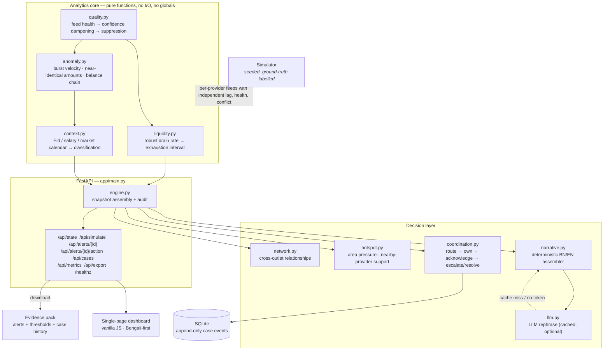

# Architecture

**Super Agent Liquidity & Risk Intelligence Platform**

One Python process, one HTML page, no frontend build step. The whole system is
declarative configuration plus pure functions, which is what makes the validation
harness and the what-if simulation nearly free.

## Components

| Module | Responsibility | Depends on |
|---|---|---|
| `simulator.py` | Builds the synthetic world and owns the ground truth for every injected episode | `domain` |
| `domain.py` | Dataclasses and enums — the vocabulary every other module speaks | — |
| `config.py` | Every analytical threshold in one auditable place | — |
| `liquidity.py` | Theil–Sen robust slope → exhaustion time, interval, confidence | `domain`, `config` |
| `quality.py` | Feed health classification and the confidence multipliers that propagate it | `domain` |
| `anomaly.py` | Burst detection and balance-chain reconciliation failure | `domain`, `quality` |
| `context.py` | Turns a raw signal into one of demand-spike / needs-review / data-quality, with rejected hypotheses | `domain` |
| `narrative.py` | Deterministic Bengali/English assembler — situation, evidence, uncertainty, next steps | `domain` |
| `llm.py` | Optional LLM rephrasing with a content-addressed disk cache and unconditional fallback | `narrative` |
| `coordination.py` | Routing, case ownership, transitions, and the append-only SQLite audit log | `domain` |
| `hotspot.py` | Area-level pressure ranking and nearby-provider support discovery | `domain` |
| `network.py` | Cross-outlet account-sharing graph and cross-provider patterns | `domain` |
| `engine.py` | The one place where the layers meet: builds the snapshot, emits alerts, exposes `act()` | all of the above |
| `main.py` | HTTP surface — JSON API plus the static dashboard | `engine` |

### Layering rule

Analytics modules are **pure functions over plain dataclasses** — no network, no
database, no globals. Nothing in the analytics core imports the engine. This is
enforced by the import graph, not by convention, and it is what makes the
analytics independently testable and the what-if re-run cheap.

## Data flow

1. **Simulate.** `Simulator` builds 12 outlets across 4 areas, each with one shared
   cash balance and three provider e-money balances, plus six hours of transaction
   history from a seeded RNG. It then plants labelled episodes (Scenario A/B/B2/C
   and a feed fault) and records their ground truth.
2. **Classify feeds.** `quality.classify_feed` turns each provider's declared
   balance and last-feed timestamp into a `FeedStatus`, comparing the declared
   balance against a replay of the transaction chain.
3. **Project.** `liquidity.project_outlet` fits a robust slope per balance over a
   trailing 60-minute window and returns an exhaustion interval, scaled by the
   feed-status confidence multiplier.
4. **Detect and classify.** `anomaly.scan` finds burst and balance-chain signals;
   `context.classify` places each against the calendar context and emits a
   classification *with the hypotheses it rejected and why*.
5. **Emit alerts.** The engine raises liquidity and anomaly alerts, subject to
   confidence and sample-size floors, routes each to an owner, and attaches
   deterministic BN/EN narratives — optionally rephrased by the model.
6. **Aggregate.** Hotspots, the relationship graph, area pressure, nearby-provider
   support suggestions, and the summary rail are all derived from the same
   snapshot, so every panel describes the same instant.
7. **Serve.** `GET /api/state` returns the assembled snapshot in one response.
8. **Coordinate.** Case actions post to `/api/alerts/{id}/action`, which appends to
   the SQLite audit log and returns the updated workflow state.
9. **Measure.** `python -m app.validation` re-runs the analytics against the
   simulator's ground truth and reports the metrics in `data/metrics.md`.

## Interfaces

| Endpoint | Method | Purpose |
|---|---|---|
| `/api/state` | GET | The whole dashboard in one internally-consistent snapshot |
| `/api/simulate` | POST | Rebuild the world: `scenario`, `outlets`, `seed`, `demand_multiplier` |
| `/api/alerts/{id}` | GET | One alert plus its case history |
| `/api/alerts/{id}/action` | POST | `acknowledge` / `escalate` / `resolve` / `note` |
| `/api/cases` | GET | Case history, optionally filtered by alert |
| `/api/metrics` | GET | Detection metrics against simulator ground truth |
| `/api/export` | GET | Full evidence pack as a downloadable JSON file |
| `/healthz` | GET | Liveness probe, and the target for a cold-start warm-up ping |

`/api/state` returns everything in **one** request rather than a dozen. The
snapshot is internally consistent by construction; parallel calls could otherwise
render a torn view where the headline total and the outlet list disagree.

## Provider boundaries

Provider separation is a scored guardrail, so it is enforced in code rather than
described in copy:

- `coordination.provider_boundary_ok()` is consulted on every case transition. An
  action whose acting provider differs from the alert's provider raises
  `PermissionError`, which `main.py` converts to **HTTP 403** carrying a boundary
  notice the dashboard renders as an explanation rather than a generic error.
- `VALID_ACTIONS` contains no financial verb. There is no function anywhere in the
  codebase that converts, transfers, settles, or refills value between providers —
  there is no such function to call.
- The unified view is a **read-only** aggregation for the agent. Provider balances
  are never summed into one headline number without the per-provider composition
  beside it, because an aggregate can look comfortable while one provider is hours
  from exhaustion.
- Escalation stays inside the provider's own track. A risk analyst receives
  escalations, but the platform records only review outcomes — never a fraud
  determination.

## Monitoring and observability

- `/healthz` is a cheap liveness probe, and doubles as the cold-start warm-up target.
- `/api/metrics` exposes precision, recall, and false-positive rate computed against
  the simulator's ground truth on the live snapshot.
- `python -m app.validation` is the offline harness: it re-runs the analytics over
  five fixed seeds and writes `data/metrics.json` and `data/metrics.md`.
- Every alert carries its own evidence trail — `evidence[]`, `uncertainty`,
  `rejected_hypotheses[]` and `recommended_steps[]` — and every case transition is
  appended to SQLite. Important alerts, ownership changes, acknowledgements,
  escalations and resolutions are therefore all traceable after the fact.
- Feed-degradation behaviour is asserted by tests rather than documented only:
  suppressed projections, damped confidence, and the absence of non-finite numbers
  in the payload are all covered in `tests/`.

## Deployment shape

A single Render web service. No database server, no cache server, no queue. SQLite
and the narration cache live on ephemeral disk and are rebuilt on restart — see
[`DEPLOYMENT.md`](DEPLOYMENT.md) for what that means for the audit trail.
