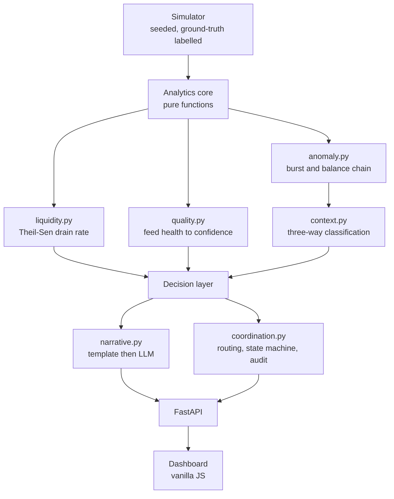

# Super Agent Liquidity & Risk Intelligence Platform — Implementation Plan

> **For agentic workers:** REQUIRED SUB-SKILL: Use superpowers:subagent-driven-development (recommended) or superpowers:executing-plans to implement this plan task-by-task. Steps use checkbox (`- [ ]`) syntax for tracking.

**Goal:** Build a working prototype that gives a multi-provider MFS super agent a unified view of shared physical cash and three separate provider e-money balances, projects liquidity shortage forward with honest uncertainty, classifies unusual activity into demand-spike / data-quality / requires-review, and routes each alert through an owned, auditable coordination workflow.

**Architecture:** One Python process (FastAPI) serving one hand-written HTML/JS dashboard. Analytics are pure functions over plain dataclasses — no I/O, no globals — which makes the validation harness and what-if simulation nearly free. A seeded simulator owns ground truth, so anomaly precision/recall and shortage lead time are measurable rather than asserted.

**Tech Stack:** Python 3.12, FastAPI, uvicorn, httpx, SQLite (stdlib `sqlite3`) for the audit trail, vanilla JS + CSS (no build step). LLM narration via `deepseek-v4-flash` on AgentRouter (Anthropic Messages shape).

**Spec:** `docs/superpowers/specs/2026-09-24-super-agent-liquidity-risk-design.md`

## Global Constraints

- **Build budget is 120 minutes total.** Order is load-bearing: every task leaves a runnable app.
- **Deploy target:** Render free tier, Singapore region. A working public URL is a submission
  requirement, so deployment is not optional polish.
- **Execution order is 1 → 10, then 12, then 11 — not numeric order.** Deploying at Task 12
  *before* the docs at Task 11 means a live, working URL exists from roughly the 80-minute mark,
  and every later commit auto-deploys onto it. Deploying last would mean that if the clock runs
  out during documentation, there is nothing to submit but a local repository.
- **Dependency budget:** `fastapi`, `uvicorn`, `httpx`. SQLite via stdlib `sqlite3`. Nothing else.
- **No frontend build step.** No npm, no bundler, no framework CDN.
- **Data is synthetic only.** No real balances, identities, credentials, or provider APIs. No `sender_hash` may map to a real person.
- **Forbidden vocabulary in all user-facing and generated text:** `fraud`, `fraudulent`, `প্রতারণা`, `cheating`, `criminal`. Advisory language only: "unusual", "requires review", "অস্বাভাবিক", "পর্যালোচনা প্রয়োজন".
- **Never pronounce a final fraud determination.** Never auto-block, freeze, accuse, or move money.
- **Provider boundaries are enforced in code.** Cross-provider actions must be rejected by `provider_boundary_ok()`, not merely discouraged in copy.
- **Numeric evidence is rendered from analytics only, never from LLM output.** The model supplies phrasing exclusively.
- **LLM call parameters:** model `deepseek-v4-flash`, `max_tokens` ≥ 2000 (reasoning model — smaller truncates the answer behind a `thinking` block), timeout 8s, on any failure fall back to the deterministic assembler.
- **Bengali is the default UI language**, with an English toggle.
- Currency formatting uses `৳` with Bengali or Latin digits per active language.

## Review Focus

Input classes and failure modes the spec implies but that no single task's tests naturally cover. Each is pinned to the task that owns the code.

1. **Zero or near-zero drain rate.** A provider with no recent transactions must report "no depletion projected" — not `ZeroDivisionError`, not `Infinity`, not `0.0 hours`. Owned by Task 3.
2. **Already-exhausted balance (≤ 0).** Must report "already depleted" with `hours_to_empty = 0`, not a negative duration. Owned by Task 3.
3. **Out-of-order or future-dated transactions.** The trailing-window calculation must sort by timestamp and exclude points at or after `now`; future timestamps must not produce negative elapsed time or a fabricated upward slope. Owned by Task 2 (generation guard) and Task 3 (sort + filter).
4. **Empty outlet — no transactions at all.** Every panel must render an explicit empty state; no `NaN`/`Infinity` may reach the DOM. Owned by Task 3 (analytics) and Task 10 (UI).
5. **Mixed-script and long Bengali text.** A Bengali string with embedded Latin digits, provider names, and `৳` amounts must not break layout, truncate the alert, or corrupt JSON. Owned by Task 7 (encoding/lint) and Task 10 (UI rendering).

---

### Task 1: Project skeleton and domain models

**Files:**
- Create: `requirements.txt`, `.env.example`, `run.sh`, `app/__init__.py`, `app/config.py`, `app/domain.py`, `tests/conftest.py`
- Test: `tests/test_domain.py`
- Also: initialize a standalone git repository (this directory currently sits inside the user's home-directory repo and must not inherit its history)

**Interfaces:**
- Consumes: nothing
- Produces: `TxnType`, `FeedStatus`, `AlertKind`, `Classification`, `CaseStatus` (all `str, Enum`); dataclasses `Provider`, `Outlet`, `Transaction`, `ProviderPosition`, `OutletState`, `Alert`, `CaseEvent`; `app.config.SETTINGS`

- [ ] **Step 1: Initialize a standalone repository and dependency files**

This directory currently sits inside the user's home-directory repo (`C:\Users\Radhe`) but is
**not tracked by it** — verified — so nesting a new repository here is safe.

```bash
cd "C:/Users/Radhe/Music/Hackthon project"
git init -q 2>/dev/null || true

# The enclosing repo is configured as "Hermes Backup <hermes@backup.local>".
# Without this, every commit in the submission carries that author. Already
# applied at repository scope so the home config is untouched.
git config user.name "JNRCHAYAN"
git config user.email "JNRCHAYAN@users.noreply.github.com"

cat > requirements.txt <<'EOF'
fastapi>=0.115,<1.0
uvicorn>=0.30,<1.0
httpx>=0.27,<1.0
pytest>=8.0,<9.0
EOF

cat > .gitignore <<'EOF'
__pycache__/
*.pyc
.venv/
venv/
.pytest_cache/
data/audit.sqlite
data/narrations/*.json
.env
EOF
```

Verify the author before the first commit lands:

```bash
git config user.name && git config user.email
```

`data/narrations/*.json` is ignored deliberately — the cache is regenerable, and committing it
would imply the narration layer's output is a fixed artifact rather than a runtime enhancement.

- [ ] **Step 2: Write the failing test**

```python
# tests/test_domain.py
from app.domain import FeedStatus, TxnType, Transaction, ProviderPosition


def test_feed_status_confidence_ordering():
    assert FeedStatus.FRESH.value == "fresh"
    assert FeedStatus.MISSING.value == "missing"


def test_transaction_sign_is_directional():
    # cash_out: cash decreases, provider e-money increases
    t = Transaction(id="t1", outlet_id="AG-1", provider_id="bkash",
                    ts=0.0, type=TxnType.CASH_OUT, amount=1000.0,
                    status="success", sender_hash="h1", balance_after=5000.0)
    assert t.cash_delta() == -1000.0
    assert t.emoney_delta() == 1000.0


def test_provider_position_defaults():
    p = ProviderPosition(provider_id="bkash", balance=5000.0,
                         opening_balance=4000.0, last_feed_at=100.0)
    assert p.declared_reconciles(5000.0) is True
    assert p.declared_reconciles(5100.0) is False
```

- [ ] **Step 3: Run test to verify it fails**

Run: `python -m pytest tests/test_domain.py -v`
Expected: FAIL — `ModuleNotFoundError: No module named 'app'`

- [ ] **Step 4: Write minimal implementation**

```python
# app/__init__.py
```

```python
# tests/conftest.py
"""Make the project root importable regardless of pytest's invocation mode."""
import sys
from pathlib import Path

ROOT = Path(__file__).resolve().parent.parent
if str(ROOT) not in sys.path:
    sys.path.insert(0, str(ROOT))
```

```python
# app/config.py
from pathlib import Path

SETTINGS = {
    "root": Path(__file__).resolve().parent.parent,
    "db_path": Path(__file__).resolve().parent.parent / "data" / "audit.sqlite",
    "llm_base_url": "https://agentrouter.org",
    "llm_model": "deepseek-v4-flash",
    "llm_max_tokens": 2000,
    "llm_timeout_s": 8.0,
    "trailing_window_minutes": 60,
    "burst_window_minutes": 12,
    "burst_amount_tolerance": 0.02,
    "burst_max_accounts": 5,
    "reconcile_tolerance": 0.01,
}
```

```python
# app/domain.py
from __future__ import annotations

from dataclasses import dataclass, field
from enum import Enum


class TxnType(str, Enum):
    CASH_IN = "cash_in"
    CASH_OUT = "cash_out"


class FeedStatus(str, Enum):
    FRESH = "fresh"
    DELAYED = "delayed"
    STALE = "stale"
    CONFLICTING = "conflicting"
    MISSING = "missing"


class AlertKind(str, Enum):
    LIQUIDITY = "liquidity"
    ANOMALY = "anomaly"
    DATA_QUALITY = "data_quality"


class Classification(str, Enum):
    NORMAL = "normal"
    DEMAND_SPIKE = "demand_spike"
    NEEDS_REVIEW = "needs_review"
    DATA_QUALITY = "data_quality"


class CaseStatus(str, Enum):
    NEW = "new"
    ACKNOWLEDGED = "acknowledged"
    ESCALATED = "escalated"
    RESOLVED = "resolved"


@dataclass(frozen=True)
class Provider:
    id: str
    name: str
    name_bn: str


@dataclass(frozen=True)
class Outlet:
    id: str
    name: str
    area: str
    thana: str
    district: str


@dataclass(frozen=True)
class Transaction:
    id: str
    outlet_id: str
    provider_id: str
    ts: float                      # epoch seconds
    type: TxnType
    amount: float
    status: str                    # success | failed | reversed
    sender_hash: str               # seeded pseudonym, never a real identity
    balance_after: float

    def cash_delta(self) -> float:
        """cash_out drains the drawer; cash_in fills it."""
        return -self.amount if self.type is TxnType.CASH_OUT else self.amount

    def emoney_delta(self) -> float:
        """cash_out grows e-money; cash_in drains it. Opposite of cash."""
        return self.amount if self.type is TxnType.CASH_OUT else -self.amount


@dataclass
class ProviderPosition:
    provider_id: str
    balance: float
    opening_balance: float
    last_feed_at: float
    feed_status: FeedStatus = FeedStatus.FRESH
    declared_drift: float = 0.0

    def declared_reconciles(self, computed: float,
                            tolerance: float = 0.01) -> bool:
        scale = max(abs(self.balance), 1.0)
        return abs(computed - self.balance) <= tolerance * scale


@dataclass
class OutletState:
    outlet: Outlet
    cash: float
    cash_opening: float
    positions: dict[str, ProviderPosition]
    transactions: list[Transaction] = field(default_factory=list)
    calendar_context: str = "ordinary"


@dataclass
class Alert:
    id: str
    outlet_id: str
    provider_id: str | None
    kind: AlertKind
    severity: str                  # low | medium | high
    confidence: float
    reason: str
    evidence: list[str] = field(default_factory=list)
    uncertainty: str = ""
    classification: Classification = Classification.NORMAL
    rejected_hypotheses: list[tuple[str, str]] = field(default_factory=list)
    recommended_steps: list[str] = field(default_factory=list)
    status: CaseStatus = CaseStatus.NEW
    owner: str = ""
    assignee: str = ""
    created_at: float = 0.0


@dataclass
class CaseEvent:
    alert_id: str
    actor: str
    action: str
    note: str
    ts: float
```

- [ ] **Step 5: Run tests and commit**

Run: `python -m pytest tests/test_domain.py -v`
Expected: PASS (3 tests)

```bash
git add -A && git commit -m "feat: project skeleton and domain models"
```

---

### Task 2: Seeded simulator with ground truth

**Files:**
- Create: `app/simulator.py`
- Test: `tests/test_simulator.py`

**Interfaces:**
- Consumes: `app.domain` (all types), `app.config.SETTINGS`
- Produces: `Episode` dataclass; `LabelledEpisode`; `Simulator(seed: int, outlets: int)`; `.world() -> dict[str, OutletState]`; `.episodes() -> list[Episode]`; `Simulator.scenario(name: str) -> Simulator`; `PROVIDERS: list[Provider]`

- [ ] **Step 1: Write the failing test**

```python
# tests/test_simulator.py
from app.domain import TxnType
from app.simulator import PROVIDERS, Simulator


def test_simulator_is_deterministic():
    a = Simulator(seed=7, outlets=3).world()
    b = Simulator(seed=7, outlets=3).world()
    assert list(a) == list(b)
    assert a[list(a)[0]].cash == b[list(b)[0]].cash


def test_two_providers_minimum_and_separate_positions():
    world = Simulator(seed=1, outlets=2).world()
    assert len(PROVIDERS) >= 2
    for state in world.values():
        assert len(state.positions) == len(PROVIDERS)
        for provider in PROVIDERS:
            assert provider.id in state.positions


def test_scenario_a_produces_provider_shortage_not_cash_shortage():
    world = Simulator(seed=3, outlets=1).scenario("A").world()
    state = next(iter(world.values()))
    # Nagad drains; shared cash stays healthy -> the headline Scenario A case
    assert state.positions["nagad"].balance < state.positions["bkash"].balance
    assert state.cash > 0


def test_transactions_are_time_ordered_and_never_future_dated():
    now = 1_700_000_000.0
    world = Simulator(seed=5, outlets=2, now=now).world()
    for state in world.values():
        stamps = [t.ts for t in state.transactions]
        assert stamps == sorted(stamps)
        assert all(t.ts <= now for t in state.transactions)


def test_ground_truth_episodes_are_labelled():
    sim = Simulator(seed=11, outlets=4)
    sim.world()
    eps = sim.episodes()
    assert eps, "simulator must expose injected ground-truth episodes"
    for e in eps:
        assert e.label in {"anomaly", "demand_spike", "data_quality"}
        assert e.outlet_id and e.provider_id
```

- [ ] **Step 2: Run test to verify it fails**

Run: `python -m pytest tests/test_simulator.py -v`
Expected: FAIL — `ModuleNotFoundError: No module named 'app.simulator'`

- [ ] **Step 3: Write minimal implementation**

```python
# app/simulator.py
from __future__ import annotations

import math
import random
from dataclasses import dataclass, field

from app.domain import (
    FeedStatus, Outlet, OutletState, Provider, ProviderPosition,
    Transaction, TxnType,
)

PROVIDERS = [
    Provider(id="bkash", name="bKash", name_bn="বিকাশ"),
    Provider(id="nagad", name="Nagad", name_bn="নগদ"),
    Provider(id="rocket", name="Rocket", name_bn="রকেট"),
]

AREAS = [("Sylhet", "Zindabazar", "Sylhet"), ("Dhaka", "Mirpur", "Dhaka"),
         ("Chattogram", "Agrabad", "Chattogram"), ("Rajshahi", "Boalia", "Rajshahi")]

HOUR = 3600.0


@dataclass
class Episode:
    outlet_id: str
    provider_id: str
    label: str            # anomaly | demand_spike | data_quality
    start: float
    end: float
    note: str = ""


@dataclass
class Simulator:
    seed: int = 42
    outlets: int = 12
    now: float = field(default=0.0)
    history_hours: int = 6
    _episodes: list[Episode] = field(default_factory=list)
    _scenario: str = "baseline"

    def __post_init__(self):
        if not self.now:
            self.now = 1_767_000_000.0
        self._rng = random.Random(self.seed)

    def scenario(self, name: str) -> "Simulator":
        self._scenario = name
        return self

    def episodes(self) -> list[Episode]:
        if not self._episodes:
            self.world()
        return self._episodes

    def _demand(self, ts: float) -> float:
        """Diurnal demand multiplier — afternoon peak, matching the Eid scenario."""
        hour = (ts / HOUR) % 24
        return 0.55 + 0.85 * math.exp(-((hour - 15.0) ** 2) / 18.0)

    def world(self) -> dict[str, OutletState]:
        rng = self._rng
        self._episodes = []
        world: dict[str, OutletState] = {}

        for i in range(self.outlets):
            area, thana, district = AREAS[i % len(AREAS)]
            outlet = Outlet(id=f"AG-{1000 + i}", name=f"Outlet {1000 + i}",
                            area=area, thana=thana, district=district)
            state = self._build_outlet(outlet, rng)
            world[outlet.id] = state

        self._inject_episodes(world)
        # Normalise: sort by time, then enforce the no-future-dated invariant.
        for state in world.values():
            state.transactions = sorted(
                (t for t in state.transactions if t.ts <= self.now),
                key=lambda t: t.ts)
        return world

    def _build_outlet(self, outlet: Outlet, rng: random.Random) -> OutletState:
        cash = round(rng.uniform(45_000, 160_000), 2)
        positions = {}
        for p in PROVIDERS:
            opening = round(rng.uniform(40_000, 190_000), 2)
            positions[p.id] = ProviderPosition(
                provider_id=p.id, balance=opening, opening_balance=opening,
                last_feed_at=self.now - rng.uniform(20, 90))

        state = OutletState(outlet=outlet, cash=cash, cash_opening=cash,
                            positions=positions)
        steps = 18
        bal = {p.id: positions[p.id].balance for p in PROVIDERS}
        for k in range(steps, 0, -1):
            ts = self.now - k * (self.history_hours * HOUR / steps)
            n = max(1, int(rng.gauss(3, 1.4) * self._demand(ts)))
            for _ in range(n):
                provider = rng.choice(PROVIDERS).id
                # cash_out dominant in the afternoon: drains cash, grows e-money
                txn_type = TxnType.CASH_OUT if rng.random() < 0.62 else TxnType.CASH_IN
                amount = round(rng.choice([500, 1000, 2000, 3000, 5000])
                               * rng.uniform(0.9, 1.15), 2)
                bal[provider] += amount if txn_type is TxnType.CASH_OUT else -amount
                state.cash += -amount if txn_type is TxnType.CASH_OUT else amount
                state.transactions.append(Transaction(
                    id=f"{outlet.id}-{provider}-{int(ts)}-{rng.randrange(10**6)}",
                    outlet_id=outlet.id, provider_id=provider, ts=ts,
                    type=txn_type, amount=amount, status="success",
                    sender_hash=f"h{rng.randrange(1, 400):04d}",
                    balance_after=round(bal[provider], 2)))

        for p in PROVIDERS:
            positions[p.id].balance = round(bal[p.id], 2)
        state.cash = round(state.cash, 2)
        return state

    def _inject_episodes(self, world: dict[str, OutletState]) -> None:
        ids = sorted(world)
        rng = self._rng

        # Scenario A: one provider drains hard while shared cash stays healthy.
        # The nagad transaction series is rebuilt from scratch so the balance
        # chain still reconciles — a deliberate break is Scenario C's job.
        if ids:
            o = ids[0]
            s = world[o]
            s.transactions = [t for t in s.transactions if t.provider_id != "nagad"]
            pos = s.positions["nagad"]
            opening = 6_200.0 + 8 * 2_100.0
            pos.opening_balance = opening
            running = opening
            drain_start = self.now - 40 * 60.0
            for j in range(8):
                ts = drain_start + j * 300.0
                running -= 2_100.0          # cash_in drains e-money
                s.transactions.append(Transaction(
                    id=f"{o}-drain-{j}", outlet_id=o, provider_id="nagad",
                    ts=ts, type=TxnType.CASH_IN, amount=2_100.0,
                    status="success", sender_hash=f"h8{j:03d}",
                    balance_after=round(running, 2)))
            pos.balance = round(running, 2)            # ৳6,200 remaining
            pos.last_feed_at = self.now - 120
            s.cash = max(42_000.0, s.cash_opening
                         + sum(t.cash_delta() for t in s.transactions))

        # Scenario B: burst of near-identical cash-outs from few accounts.
        if len(ids) > 1:
            o = ids[1]
            start = self.now - 12 * 60
            accounts = [f"h9{i:03d}" for i in range(4)]
            bal = world[o].positions["bkash"].balance
            for j in range(9):
                ts = start + j * 70
                amount = 9_900.0 * (1 + rng.uniform(-0.008, 0.008))
                bal += amount
                world[o].transactions.append(Transaction(
                    id=f"{o}-burst-{j}", outlet_id=o, provider_id="bkash", ts=ts,
                    type=TxnType.CASH_OUT, amount=round(amount, 2),
                    status="success", sender_hash=accounts[j % len(accounts)],
                    balance_after=round(bal, 2)))
            self._episodes.append(Episode(
                outlet_id=o, provider_id="bkash", label="anomaly",
                start=start, end=self.now,
                note="9 near-identical cash-outs from 4 accounts in 12 min"))

        # Scenario B2: a legitimate Eid-window surge — must NOT be flagged.
        if len(ids) > 2:
            o = ids[2]
            world[o].calendar_context = "eid_window"
            start = self.now - 20 * 60
            bal = world[o].positions["rocket"].balance
            for j in range(14):
                ts = start + j * 80
                amount = 500.0 * rng.uniform(1, 18)
                bal += amount
                world[o].transactions.append(Transaction(
                    id=f"{o}-eid-{j}", outlet_id=o, provider_id="rocket", ts=ts,
                    type=TxnType.CASH_OUT, amount=round(amount, 2),
                    status="success",
                    sender_hash=f"h{rng.randrange(100, 399):04d}",
                    balance_after=round(bal, 2)))
            self._episodes.append(Episode(
                outlet_id=o, provider_id="rocket", label="demand_spike",
                start=start, end=self.now,
                note="diverse-account Eid surge — expected, must not be flagged"))

        # Scenario C: balance chain that does not reconcile.
        if len(ids) > 3:
            o = ids[3]
            pos = world[o].positions["bkash"]
            pos.balance = round(pos.balance + 25_000.0, 2)  # unexplained jump
            pos.feed_status = FeedStatus.CONFLICTING
            self._episodes.append(Episode(
                outlet_id=o, provider_id="bkash", label="data_quality",
                start=self.now - 600, end=self.now,
                note="declared balance exceeds reconciled chain by 25,000"))

        # Feed faults: stale feed on one outlet.
        if len(ids) > 4:
            pos = world[ids[4]].positions["nagad"]
            pos.feed_status = FeedStatus.STALE
            pos.last_feed_at = self.now - 45 * 60
```

- [ ] **Step 4: Run tests and commit**

Run: `python -m pytest tests/test_simulator.py -v`
Expected: PASS (5 tests)

```bash
git add -A && git commit -m "feat: seeded simulator with labelled ground-truth episodes"
```

---

### Task 3: Liquidity projection analytics

**Files:**
- Create: `app/liquidity.py`
- Test: `tests/test_liquidity.py`

**Interfaces:**
- Consumes: `app.domain.Transaction`, `ProviderPosition`, `OutletState`, `FeedStatus`
- Produces: `SlopeFit(slope, low, high, n, residual_scale)`; `theil_sen(points) -> SlopeFit`; `Projection` dataclass; `project_balance(label, balance, points, confidence_mult) -> Projection`; `project_outlet(state, now) -> list[Projection]`

- [ ] **Step 1: Write the failing test**

```python
# tests/test_liquidity.py
import pytest

from app.domain import FeedStatus
from app.liquidity import apply_demand, project_balance, theil_sen


def _line(start_balance, rate_per_hour, n=20, step_hours=0.1):
    return [(i * step_hours, start_balance - rate_per_hour * i * step_hours)
            for i in range(n)]


def test_theil_sen_recovers_a_clean_slope():
    fit = theil_sen(_line(10_000, 2_000))
    assert abs(fit.slope - (-2_000)) < 1.0
    assert fit.n == 20


def test_theil_sen_resists_a_single_outlier():
    pts = _line(10_000, 2_000)
    pts[10] = (pts[10][0], pts[10][1] + 400_000)   # one absurd spike
    fit = theil_sen(pts)
    assert abs(fit.slope - (-2_000)) < 300


def test_projection_reports_interval_and_time():
    p = project_balance("nagad", 6_200, _line(6_200, 2_100), 1.0)
    assert p.exhausted is False
    assert p.hours_to_empty is not None
    assert 1.5 < p.hours_to_empty < 5.0
    assert p.low_hours <= p.hours_to_empty <= p.high_hours


def test_zero_drain_reports_no_depletion_not_infinity():
    p = project_balance("nagad", 6_200, _line(6_200, 0.0), 1.0)
    assert p.hours_to_empty is None
    assert p.low_hours is None and p.high_hours is None


def test_insufficient_points_reports_none_not_crash():
    p = project_balance("nagad", 6_200, [(0.0, 6_200.0)], 1.0)
    assert p.hours_to_empty is None


def test_already_exhausted_balance_is_zero_hours():
    p = project_balance("nagad", 0.0, _line(9_000, 2_000), 1.0)
    assert p.exhausted is True
    assert p.hours_to_empty == 0.0


def test_future_dated_points_are_excluded():
    pts = _line(6_200, 2_100) + [(99.0, 500_000.0)]
    p = project_balance("nagad", 6_200, pts, 1.0, now_hours=2.0)
    assert p.points_used == 20


def test_confidence_multiplier_scales_confidence():
    full = project_balance("nagad", 6_200, _line(6_200, 2_100), 1.0)
    damped = project_balance("nagad", 6_200, _line(6_200, 2_100), 0.5)
    assert damped.confidence < full.confidence


def test_apply_demand_scales_exhaustion_proportionally():
    base = project_balance("nagad", 6_200, _line(6_200, 2_100), 1.0)
    hotter = apply_demand(base, 2.5)
    assert hotter.rate_per_hour == pytest.approx(base.rate_per_hour * 2.5)
    assert hotter.hours_to_empty == pytest.approx(base.hours_to_empty / 2.5,
                                                  rel=0.01)


def test_apply_demand_is_a_noop_at_one():
    base = project_balance("nagad", 6_200, _line(6_200, 2_100), 1.0)
    assert apply_demand(base, 1.0).hours_to_empty == base.hours_to_empty


def test_apply_demand_preserves_the_no_depletion_case():
    idle = project_balance("nagad", 6_200, _line(6_200, 0.0), 1.0)
    assert apply_demand(idle, 3.0).hours_to_empty is None
```

- [ ] **Step 2: Run test to verify it fails**

Run: `python -m pytest tests/test_liquidity.py -v`
Expected: FAIL — `ModuleNotFoundError: No module named 'app.liquidity'`

- [ ] **Step 3: Write minimal implementation**

```python
# app/liquidity.py
from __future__ import annotations

from dataclasses import dataclass
from statistics import median

from app.config import SETTINGS
from app.domain import FeedStatus, TxnType

EPS = 1e-6


@dataclass
class SlopeFit:
    slope: float          # balance units per hour (negative == draining)
    low: float            # 10th percentile of pairwise slopes
    high: float           # 90th percentile of pairwise slopes
    n: int
    residual_scale: float


@dataclass
class Projection:
    label: str
    balance: float
    rate_per_hour: float        # positive == draining
    hours_to_empty: float | None
    low_hours: float | None
    high_hours: float | None
    exhausted: bool
    confidence: float
    points_used: int


def _pct(sorted_vals: list[float], q: float) -> float:
    if not sorted_vals:
        return 0.0
    idx = min(len(sorted_vals) - 1, max(0, int(q * (len(sorted_vals) - 1))))
    return sorted_vals[idx]


def theil_sen(points: list[tuple[float, float]]) -> SlopeFit:
    """Robust slope via median of pairwise slopes.

    A naive mean is destroyed by one large Eid transaction, which is exactly
    the situation this product must survive.
    """
    n = len(points)
    if n < 2:
        return SlopeFit(0.0, 0.0, 0.0, n, 0.0)

    slopes: list[float] = []
    for i in range(n):
        xi, yi = points[i]
        for j in range(i + 1, n):
            dx = points[j][0] - xi
            if dx > EPS:
                slopes.append((points[j][1] - yi) / dx)

    if not slopes:
        return SlopeFit(0.0, 0.0, 0.0, n, 0.0)

    slopes.sort()
    m = len(slopes)
    slope = slopes[m // 2] if m % 2 else (slopes[m // 2 - 1] + slopes[m // 2]) / 2.0
    intercept = median([y - slope * x for x, y in points])
    residual_scale = median([abs(y - (intercept + slope * x)) for x, y in points])

    return SlopeFit(slope=slope, low=_pct(slopes, 0.10), high=_pct(slopes, 0.90),
                    n=n, residual_scale=residual_scale)


def project_balance(label: str, balance: float,
                    points: list[tuple[float, float]],
                    confidence_mult: float = 1.0,
                    now_hours: float | None = None) -> Projection:
    """Project time to exhaustion. Never returns Infinity or a negative duration."""
    if now_hours is not None:
        points = [(x, y) for x, y in points if x <= now_hours]
    points = sorted(points)

    if balance <= 0.0:
        return Projection(label, balance, 0.0, 0.0, 0.0, 0.0, True,
                          max(0.05, 0.9 * confidence_mult), len(points))

    if len(points) < 2:
        return Projection(label, balance, 0.0, None, None, None, False,
                          max(0.05, 0.25 * confidence_mult), len(points))

    fit = theil_sen(points)
    rate = -fit.slope                       # positive == draining
    if rate <= EPS:
        # Zero or rising balance: no depletion is projected. Not Infinity.
        return Projection(label, balance, 0.0, None, None, None, False,
                          max(0.05, 0.55 * confidence_mult), len(points))

    hours = balance / rate
    drain_low = max(-fit.high, EPS)         # flattest credible drain -> latest
    drain_high = max(-fit.low, EPS)         # steepest credible drain -> earliest
    high_hours = balance / drain_low
    low_hours = balance / drain_high

    rel_uncertainty = min(1.0, (high_hours - low_hours) / max(hours, EPS))
    sample = min(1.0, len(points) / 20.0)
    confidence = 0.35 + 0.45 * sample - 0.30 * rel_uncertainty
    confidence = max(0.05, min(0.98, confidence * confidence_mult))

    return Projection(label, balance, rate, hours, low_hours, high_hours, False,
                      confidence, len(points))


def _confidence_multiplier(status: FeedStatus) -> float:
    from app.quality import CONFIDENCE_MULTIPLIER
    return CONFIDENCE_MULTIPLIER.get(status, 0.5)


def apply_demand(projection: Projection, multiplier: float) -> Projection:
    """What-if hook: scale the drain rate by a demand multiplier.

    Exhaustion time scales inversely, which is the honest first-order answer to
    "what if demand rises N times?". The estimation uncertainty is unchanged, so
    absolute confidence is preserved.
    """
    if multiplier == 1.0 or projection.hours_to_empty is None:
        return projection
    mult = max(0.05, float(multiplier))
    return Projection(
        label=projection.label, balance=projection.balance,
        rate_per_hour=projection.rate_per_hour * mult,
        hours_to_empty=projection.hours_to_empty / mult,
        low_hours=(projection.low_hours / mult
                   if projection.low_hours is not None else None),
        high_hours=(projection.high_hours / mult
                    if projection.high_hours is not None else None),
        exhausted=projection.exhausted, confidence=projection.confidence,
        points_used=projection.points_used)


def project_outlet(state, now: float) -> list[Projection]:
    """Project shared cash and every provider e-money balance separately."""
    window = SETTINGS["trailing_window_minutes"] * 60.0
    cutoff = now - window
    base = now / 3600.0

    cash_points: list[tuple[float, float]] = []
    running = state.cash_opening
    for t in state.transactions:
        if t.ts < cutoff or t.ts > now:
            continue
        running += t.cash_delta()
        cash_points.append((t.ts / 3600.0, running))
    if not cash_points:
        cash_points = [(base, state.cash)]

    projections = [project_balance("cash", state.cash, cash_points, 1.0, base)]

    for pid, pos in state.positions.items():
        bal = pos.opening_balance
        points: list[tuple[float, float]] = []
        for t in state.transactions:
            if t.provider_id != pid or t.ts < cutoff or t.ts > now:
                continue
            bal += t.emoney_delta()
            points.append((t.ts / 3600.0, bal))
        if not points:
            points = [(base, pos.balance)]
        else:
            points[-1] = (points[-1][0], pos.balance)   # trust declared latest

        projections.append(project_balance(
            pid, pos.balance, points,
            _confidence_multiplier(pos.feed_status), base))

    return projections
```

- [ ] **Step 4: Run tests and commit**

Run: `python -m pytest tests/test_liquidity.py -v`
Expected: PASS (8 tests)

```bash
git add -A && git commit -m "feat: Theil-Sen liquidity projection with honest intervals"
```

---

### Task 4: Feed quality, confidence propagation, and safe suppression

**Files:**
- Create: `app/quality.py`
- Test: `tests/test_quality.py`

**Interfaces:**
- Consumes: `app.domain.FeedStatus`, `OutletState`, `Transaction`, `TxnType`
- Produces: `CONFIDENCE_MULTIPLIER: dict[FeedStatus, float]`; `reconcile(opening, txns) -> float`; `classify_feed(last_feed_at, now, drift) -> FeedStatus`; `should_suppress(status) -> bool`; `SUPPRESSION_NOTICE`; `outlet_reliability(state, now) -> tuple[float, list[str]]`

- [ ] **Step 1: Write the failing test**

```python
# tests/test_quality.py
import pytest

from app.domain import FeedStatus, Transaction, TxnType
from app.quality import (
    CONFIDENCE_MULTIPLIER, SUPPRESSION_NOTICE, classify_feed, reconcile,
    should_suppress,
)


def _txn(amount, kind=TxnType.CASH_OUT, bal=100.0):
    return Transaction(id="t", outlet_id="AG-1", provider_id="nagad", ts=1.0,
                       type=kind, amount=amount, status="success",
                       sender_hash="h1", balance_after=bal)


def test_multiplier_ordering_is_monotonic():
    assert (CONFIDENCE_MULTIPLIER[FeedStatus.FRESH]
            > CONFIDENCE_MULTIPLIER[FeedStatus.DELAYED]
            > CONFIDENCE_MULTIPLIER[FeedStatus.STALE]
            > CONFIDENCE_MULTIPLIER[FeedStatus.CONFLICTING])


def test_reconcile_matches_manual_arithmetic():
    txns = [_txn(1000, TxnType.CASH_OUT), _txn(300, TxnType.CASH_IN)]
    assert reconcile(5_000, txns) == pytest.approx(5_000 + 1000 - 300)


def test_feed_status_escalates_with_lag():
    now = 1_000_000.0
    assert classify_feed(now - 30, now, 0.0) is FeedStatus.FRESH
    assert classify_feed(now - 480, now, 0.0) is FeedStatus.DELAYED
    assert classify_feed(now - 3000, now, 0.0) is FeedStatus.STALE
    assert classify_feed(None, now, 0.0) is FeedStatus.MISSING


def test_conflicting_drift_overrides_freshness():
    assert classify_feed(1_000_000.0, 1_000_000.0, 25_000.0) is FeedStatus.CONFLICTING


def test_suppression_only_for_conflicting_or_missing():
    assert should_suppress(FeedStatus.CONFLICTING) is True
    assert should_suppress(FeedStatus.MISSING) is True
    assert should_suppress(FeedStatus.STALE) is False


def test_suppression_notice_forbids_action():
    assert "verify" in SUPPRESSION_NOTICE.lower()
```

- [ ] **Step 2: Run test to verify it fails**

Run: `python -m pytest tests/test_quality.py -v`
Expected: FAIL — `ModuleNotFoundError: No module named 'app.quality'`

- [ ] **Step 3: Write minimal implementation**

```python
# app.quality.py
from __future__ import annotations

from app.domain import FeedStatus, TxnType

CONFIDENCE_MULTIPLIER = {
    FeedStatus.FRESH: 1.0,
    FeedStatus.DELAYED: 0.8,
    FeedStatus.STALE: 0.5,
    FeedStatus.CONFLICTING: 0.3,
    FeedStatus.MISSING: 0.0,
}

SUPPRESSION_NOTICE = (
    "Provider feed data is unreliable. Verify the feed before acting on any "
    "projection for this provider."
)
SUPPRESSION_NOTICE_BN = (
    "প্রদানকারীর ডেটা নির্ভরযোগ্য নয়। কোনো সিদ্ধান্ত নেওয়ার আগে ফিডটি যাচাই করুন।"
)

DELAYED_AFTER_S = 300.0      # 5 min
STALE_AFTER_S = 1800.0       # 30 min


def reconcile(opening: float, txns: list) -> float:
    """Replay the e-money chain from opening balance over signed transactions."""
    total = opening
    for t in txns:
        total += t.amount if t.type is TxnType.CASH_OUT else -t.amount
    return total


DRIFT_FLOOR = 1_000.0     # ignore rounding noise below this


def classify_feed(last_feed_at: float | None, now: float,
                  drift: float) -> FeedStatus:
    """Drift (unexplained balance movement) outranks freshness."""
    if last_feed_at is None:
        return FeedStatus.MISSING
    if abs(drift) > DRIFT_FLOOR:
        return FeedStatus.CONFLICTING
    lag = now - last_feed_at
    if lag > STALE_AFTER_S:
        return FeedStatus.STALE
    if lag > DELAYED_AFTER_S:
        return FeedStatus.DELAYED
    return FeedStatus.FRESH


def should_suppress(status: FeedStatus) -> bool:
    """Reliability rule: a degraded feed must never yield a confident conclusion."""
    return status in (FeedStatus.CONFLICTING, FeedStatus.MISSING)


def outlet_reliability(state, now: float) -> tuple[float, list[str]]:
    """Aggregate confidence multiplier plus human-readable degradation notes."""
    mult = 1.0
    notes: list[str] = []
    for pid, pos in state.positions.items():
        status = pos.feed_status
        mult *= CONFIDENCE_MULTIPLIER.get(status, 0.5)
        if status is not FeedStatus.FRESH:
            age = int((now - pos.last_feed_at) / 60) if pos.last_feed_at else -1
            notes.append(f"{pid}: {status.value}"
                         + (f" ({age} min old)" if age >= 0 else " (no feed)"))
    return max(0.05, mult), notes
```

- [ ] **Step 4: Run tests and commit**

Run: `python -m pytest tests/test_quality.py -v`
Expected: PASS (6 tests)

```bash
git add -A && git commit -m "feat: feed quality propagation and safe suppression"
```

---

### Task 5: Anomaly detection

**Files:**
- Create: `app/anomaly.py`
- Test: `tests/test_anomaly.py`

**Interfaces:**
- Consumes: `app.domain.Transaction`, `OutletState`, `FeedStatus`; `app.quality.reconcile`
- Produces: `AnomalySignal` dataclass; `detect_burst(txns, provider_id=None) -> AnomalySignal | None`; `detect_balance_drift(state) -> AnomalySignal | None`; `scan(state, now) -> list[AnomalySignal]`

- [ ] **Step 1: Write the failing test**

```python
# tests/test_anomaly.py
from app.domain import Transaction, TxnType
from app.anomaly import detect_burst


def _t(amount, sender, ts=0.0, provider="bkash"):
    return Transaction(id=f"x{ts}{sender}", outlet_id="AG-1", provider_id=provider,
                       ts=ts, type=TxnType.CASH_OUT, amount=amount,
                       status="success", sender_hash=sender, balance_after=0.0)


def test_burst_of_near_identical_amounts_from_few_accounts_is_flagged():
    txns = [_t(9_900 * (1 + 0.001 * i), f"h{i % 4}", ts=i * 70)
            for i in range(9)]
    sig = detect_burst(txns)
    assert sig is not None
    assert sig.kind == "burst_identical"
    assert len(set(sig.accounts)) <= 5
    assert sig.evidence


def test_diverse_accounts_are_not_flagged():
    txns = [_t(500 * (i + 1), f"h{i:03d}", ts=i * 80) for i in range(14)]
    assert detect_burst(txns) is None


def test_wide_amount_spread_is_not_flagged():
    txns = [_t(100 * (3 ** i % 90), f"h{i % 4}", ts=i * 70) for i in range(9)]
    assert detect_burst(txns) is None


def test_too_few_transactions_is_not_flagged():
    assert detect_burst([_t(9_900, "h1", ts=0), _t(9_900, "h2", ts=60)]) is None


def test_burst_is_scoped_per_provider():
    txns = ([_t(9_900, f"h{i % 4}", ts=i * 70, provider="bkash") for i in range(9)]
            + [_t(9_900, f"g{i % 4}", ts=i * 70, provider="nagad") for i in range(9)])
    sig = detect_burst(txns, provider_id="bkash")
    assert sig is not None
    assert all(s.startswith("h") for s in sig.accounts)
```

- [ ] **Step 2: Run test to verify it fails**

Run: `python -m pytest tests/test_anomaly.py -v`
Expected: FAIL — `ModuleNotFoundError: No module named 'app.anomaly'`

- [ ] **Step 3: Write minimal implementation**

```python
# app/anomaly.py
from __future__ import annotations

from collections import Counter
from dataclasses import dataclass, field

from app.config import SETTINGS
from app.domain import TxnType
from app.quality import reconcile

MIN_BURST_TXNS = 6


@dataclass
class AnomalySignal:
    kind: str                      # burst_identical | balance_chain
    provider_id: str | None
    accounts: list[str] = field(default_factory=list)
    amounts: list[float] = field(default_factory=list)
    window_minutes: int = 0
    magnitude: float = 0.0
    evidence: list[str] = field(default_factory=list)


def detect_burst(txns: list, provider_id: str | None = None,
                 window_minutes: int | None = None) -> AnomalySignal | None:
    """Near-identical amounts, few distinct accounts, high velocity in a window."""
    window = window_minutes or SETTINGS["burst_window_minutes"]
    tol = SETTINGS["burst_amount_tolerance"]
    max_accounts = SETTINGS["burst_max_accounts"]

    pool = [t for t in txns if t.status == "success"]
    if provider_id is not None:
        pool = [t for t in pool if t.provider_id == provider_id]

    by_provider: dict[str, list] = {}
    for t in pool:
        by_provider.setdefault(t.provider_id, []).append(t)

    for pid, group in by_provider.items():
        group = sorted(group, key=lambda t: t.ts)
        for i, anchor in enumerate(group):
            hi = anchor.ts + window * 60.0
            bucket = [t for t in group[i:] if t.ts <= hi]
            if len(bucket) < MIN_BURST_TXNS:
                continue
            # Near-identical: anchor amount plus at least MIN-1 within tolerance
            similar = [t for t in bucket
                       if abs(t.amount - anchor.amount)
                       <= tol * max(abs(anchor.amount), 1.0)]
            if len(similar) < MIN_BURST_TXNS:
                continue
            accounts = [t.sender_hash for t in similar]
            if len(set(accounts)) > max_accounts:
                continue
            # Amounts must NOT be broadly spread (that is ordinary demand)
            amounts = [t.amount for t in similar]
            if max(amounts) - min(amounts) > tol * 4 * max(abs(anchor.amount), 1.0):
                continue

            total = sum(amounts)
            return AnomalySignal(
                kind="burst_identical", provider_id=pid,
                accounts=sorted(set(accounts)), amounts=amounts,
                window_minutes=window,
                magnitude=float(len(similar)),
                evidence=[
                    f"{len(similar)} transactions within ±{int(tol * 100)}% of "
                    f"৳{anchor.amount:,.0f} in {window} minutes",
                    f"originating from only {len(set(accounts))} distinct accounts",
                    f"combined value ৳{total:,.0f}",
                ])
    return None


def detect_balance_drift(state) -> AnomalySignal | None:
    """Balance chain failure — classified as data quality, never as suspicion."""
    for pid, pos in state.positions.items():
        provider_txns = [t for t in state.transactions if t.provider_id == pid]
        if not provider_txns:
            continue
        computed = reconcile(pos.opening_balance, provider_txns)
        drift = pos.balance - computed
        if not pos.declared_reconciles(computed):
            pos.declared_drift = round(drift, 2)
            return AnomalySignal(
                kind="balance_chain", provider_id=pid, magnitude=abs(drift),
                evidence=[
                    f"declared balance ৳{pos.balance:,.0f}",
                    f"reconciled from opening + transactions ৳{computed:,.0f}",
                    f"unexplained difference ৳{drift:,.0f}",
                ])
    return None


def scan(state, now: float) -> list[AnomalySignal]:
    signals: list[AnomalySignal] = []
    burst = detect_burst(state.transactions)
    if burst:
        signals.append(burst)
    drift = detect_balance_drift(state)
    if drift:
        signals.append(drift)
    return signals
```

- [ ] **Step 4: Run tests and commit**

Run: `python -m pytest tests/test_anomaly.py -v`
Expected: PASS (5 tests)

```bash
git add -A && git commit -m "feat: burst and balance-chain anomaly detection"
```

---

### Task 6: Context classification — the three-way verdict

**Files:**
- Create: `app/context.py`
- Test: `tests/test_context.py`

**Interfaces:**
- Consumes: `app.anomaly.AnomalySignal`, `app.domain.Transaction`, `Classification`
- Produces: `calendar_context(ts) -> str`; `Verdict` dataclass; `classify(signal, txns, ctx) -> Verdict`; `verdict_to_alert_fields(verdict) -> dict`

- [ ] **Step 1: Write the failing test**

```python
# tests/test_context.py
from app.anomaly import AnomalySignal
from app.context import Verdict, calendar_context, classify
from app.domain import Classification, Transaction, TxnType


def _burst(accounts=4, amounts=None):
    amounts = amounts or [9_900.0] * 9
    return AnomalySignal(kind="burst_identical", provider_id="bkash",
                         accounts=[f"h{i}" for i in range(accounts)],
                         amounts=amounts, window_minutes=12, magnitude=9.0,
                         evidence=["9 near-identical transactions"])


def test_burst_with_few_accounts_and_narrow_amounts_needs_review():
    v = classify(_burst(), [], "ordinary")
    assert v.classification is Classification.NEEDS_REVIEW
    assert v.priority == "high"
    assert v.rejected_hypotheses


def test_diverse_accounts_in_eid_window_is_demand_spike():
    amounts = [500.0 * (i + 1) for i in range(14)]
    sig = AnomalySignal(kind="burst_identical", provider_id="bkash",
                        accounts=[f"h{i:03d}" for i in range(14)],
                        amounts=amounts, window_minutes=12, magnitude=14.0,
                        evidence=["14 transactions"])
    v = classify(sig, [], "eid_window")
    assert v.classification is Classification.DEMAND_SPIKE
    assert v.priority == "low"


def test_balance_chain_always_classifies_as_data_quality():
    sig = AnomalySignal(kind="balance_chain", provider_id="bkash",
                        magnitude=25_000.0, evidence=["difference ৳25,000"])
    v = classify(sig, [], "ordinary")
    assert v.classification is Classification.DATA_QUALITY
    assert v.rejected_hypotheses[0][0] == "suspicious activity"


def test_rejected_hypotheses_name_the_reason():
    v = classify(_burst(), [], "ordinary")
    labels = dict(v.rejected_hypotheses)
    assert "operational demand spike" in labels
    assert labels["operational demand spike"]


def test_calendar_context_detects_salary_day():
    # 2026-03-03 — day-of-month 3, inside the salary window, outside the Eid window
    assert calendar_context(1_772_500_000.0) == "salary_day"


def test_calendar_context_detects_the_eid_window():
    # Inside EID_WINDOWS
    assert calendar_context(1_774_200_000.0) == "eid_window"
```

- [ ] **Step 2: Run test to verify it fails**

Run: `python -m pytest tests/test_context.py -v`
Expected: FAIL — `ModuleNotFoundError: No module named 'app.context'`

- [ ] **Step 3: Write minimal implementation**

```python
# app/context.py
from __future__ import annotations

import datetime as _dt
from dataclasses import dataclass, field

from app.domain import Classification

# Eid-ul-Fitr 2026 falls around 2026-03-20; a ±3 day window is treated as context.
EID_WINDOWS = [(1_774_000_000.0, 1_774_600_000.0)]

DEMAND_SPIKE_ACCOUNT_FLOOR = 8      # at/above this many accounts -> diverse
NARROW_SPREAD_RATIO = 0.05          # max/min spread below this -> near-identical


@dataclass
class Verdict:
    classification: Classification
    confidence: float
    priority: str                                # low | medium | high
    accepted: str = ""
    rejected_hypotheses: list[tuple[str, str]] = field(default_factory=list)
    rationale: list[str] = field(default_factory=list)


def calendar_context(ts: float) -> str:
    for start, end in EID_WINDOWS:
        if start <= ts <= end:
            return "eid_window"
    day = _dt.datetime.fromtimestamp(ts, tz=_dt.timezone.utc)
    if day.day <= 5:
        return "salary_day"
    if day.weekday() in (4, 5):     # Fri/Sat weekend market peak in Bangladesh
        return "market_day"
    return "ordinary"


def _spread_ratio(amounts: list[float]) -> float:
    if not amounts:
        return 0.0
    lo, hi = min(amounts), max(amounts)
    if hi <= 0:
        return 0.0
    return (hi - lo) / hi


def classify(signal, txns: list, ctx: str) -> Verdict:
    """Distinguish operational demand spike / data quality / requires review.

    The same chart can mean any of the three. Emitting a bare score is the
    failure mode this function exists to prevent.
    """
    if signal.kind == "balance_chain":
        return Verdict(
            classification=Classification.DATA_QUALITY,
            confidence=0.9, priority="medium",
            accepted="data-quality problem — balance chain does not reconcile",
            rejected_hypotheses=[
                ("suspicious activity",
                 "an unexplained balance difference is a data integrity fault; "
                 "it does not evidence customer behaviour"),
                ("operational demand spike",
                 "reconciliation failure is independent of transaction volume"),
            ],
            rationale=[
                "provider-declared balance disagrees with the reconciled chain",
                "recommend feed verification before any interpretation",
            ])

    accounts = len(set(signal.accounts))
    spread = _spread_ratio(signal.amounts)
    context_aligned = ctx in ("eid_window", "salary_day", "market_day")

    if accounts >= DEMAND_SPIKE_ACCOUNT_FLOOR and spread > NARROW_SPREAD_RATIO:
        return Verdict(
            classification=Classification.DEMAND_SPIKE,
            confidence=0.75, priority="low",
            accepted="operational demand spike"
                     + (f" consistent with {ctx.replace('_', ' ')}" if context_aligned else ""),
            rejected_hypotheses=[
                ("pattern requiring review",
                 f"activity is spread across {accounts} distinct accounts with a "
                 f"broad amount range ({spread:.0%} spread), which is ordinary "
                 "high-demand behaviour rather than concentrated activity"),
                ("data-quality problem",
                 "the balance chain reconciles; only volume is elevated"),
            ],
            rationale=[
                f"{accounts} distinct accounts involved",
                f"amount spread {spread:.0%} — not near-identical",
                f"calendar context: {ctx}",
            ])

    reasons_rejected: list[tuple[str, str]] = []
    if not context_aligned:
        reasons_rejected.append(
            ("operational demand spike",
             f"no seasonal or salary-day context on this date; activity is "
             f"concentrated in only {accounts} accounts"))
    else:
        reasons_rejected.append(
            ("operational demand spike",
             f"although the date is within the {ctx.replace('_', ' ')} window, "
             f"activity is concentrated in only {accounts} accounts with "
             f"near-identical amounts"))
    reasons_rejected.append(
        ("data-quality problem", "the balance chain reconciles cleanly"))

    return Verdict(
        classification=Classification.NEEDS_REVIEW,
        confidence=0.72, priority="high",
        accepted="pattern requiring human review",
        rejected_hypotheses=reasons_rejected,
        rationale=[
            f"{accounts} accounts only, {len(signal.amounts)} transactions",
            f"amount spread {spread:.0%} — near-identical",
            f"calendar context: {ctx}",
            "advisory only — this is not a determination of wrongdoing",
        ])


def verdict_to_alert_fields(verdict: Verdict) -> dict:
    severity = {"high": "high", "medium": "medium", "low": "low"}[verdict.priority]
    return {
        "classification": verdict.classification,
        "severity": severity,
        "confidence": verdict.confidence,
        "rejected_hypotheses": verdict.rejected_hypotheses,
        "reason": verdict.accepted,
    }
```

- [ ] **Step 4: Run tests and commit**

Run: `python -m pytest tests/test_context.py -v`
Expected: PASS (5 tests)

```bash
git add -A && git commit -m "feat: three-way context classification for unusual activity"
```

---

### Task 7: Deterministic bilingual narrative assembler

**Files:**
- Create: `app/narrative.py`
- Test: `tests/test_narrative.py`

**Interfaces:**
- Consumes: `app.liquidity.Projection`, `app.domain.Alert`, `Classification`
- Produces: `Narrative` dataclass; `assemble_liquidity(...)`, `assemble_anomaly(...)`, `assemble_data_quality(...)`; `lint(text) -> list[str]`; `FORBIDDEN`; `format_bdt(amount, lang)`

- [ ] **Step 1: Write the failing test**

```python
# tests/test_narrative.py
from app.domain import AlertKind, Classification
from app.liquidity import Projection
from app.narrative import (
    FORBIDDEN, assemble_anomaly, assemble_data_quality, assemble_liquidity,
    format_bdt, lint,
)


def _proj(hours=3.1, low=2.4, high=4.0, conf=0.71, label="nagad"):
    return Projection(label=label, balance=6_200.0, rate_per_hour=2_100.0,
                      hours_to_empty=hours, low_hours=low, high_hours=high,
                      exhausted=False, confidence=conf, points_used=20)


def test_liquidity_narrative_carries_four_required_parts():
    n = assemble_liquidity(_proj(), "nagad", "Nagad", "নগদ", "bn")
    assert n.situation and n.evidence and n.uncertainty and n.next_steps
    assert any("৬" in e or "6" in e for e in n.evidence)


def test_uncertainty_states_the_interval_not_a_point():
    n = assemble_liquidity(_proj(), "nagad", "Nagad", "নগদ", "bn")
    assert "2.4" in n.uncertainty or "২.৪" in n.uncertainty


def test_suppressed_projection_refuses_to_recommend():
    n = assemble_liquidity(_proj(), "nagad", "Nagad", "নগদ", "en",
                           suppressed=True)
    assert n.next_steps
    assert any("verify" in s.lower() for s in n.next_steps)
    assert "fraud" not in n.situation.lower()


def test_suppressed_projection_also_works_in_bengali():
    n = assemble_liquidity(_proj(), "nagad", "Nagad", "নগদ", "bn",
                           suppressed=True)
    assert n.next_steps
    assert any(c > "ঀ" for s in n.next_steps for c in s)


def test_anomaly_narrative_names_rejected_hypotheses():
    rejected = [("operational demand spike", "amounts are near-identical")]
    n = assemble_anomaly("9 near-identical cash-outs", rejected, "bn")
    assert any("demand spike" in r for r in n.uncertainty_multiline().__iter__()) \
        or n.rejected_text
    assert n.rejected_text


def test_forbidden_vocabulary_is_detected():
    for word in FORBIDDEN:
        assert lint(f"this is {word} activity")
    assert not lint("this activity requires review")


def test_generated_narratives_contain_no_forbidden_vocabulary():
    for n in (assemble_liquidity(_proj(), "nagad", "Nagad", "নগদ", "bn"),
              assemble_anomaly("9 near-identical cash-outs", [], "bn"),
              assemble_data_quality("৳25,000", "bn")):
        blob = " ".join([n.situation] + n.evidence + [n.uncertainty, n.rejected_text]
                        + n.next_steps)
        assert lint(blob) == []


def test_bdt_formatting_per_language():
    assert format_bdt(6_200, "en") == "৳6,200"
    assert "৳" in format_bdt(6_200, "bn")


def test_english_and_bengali_both_produced():
    en = assemble_liquidity(_proj(), "nagad", "Nagad", "নগদ", "en")
    bn = assemble_liquidity(_proj(), "nagad", "Nagad", "নগদ", "bn")
    assert en.situation != bn.situation
    assert any(c > "\u0980" for c in bn.situation)
```

- [ ] **Step 2: Run test to verify it fails**

Run: `python -m pytest tests/test_narrative.py -v`
Expected: FAIL — `ModuleNotFoundError: No module named 'app.narrative'`

- [ ] **Step 3: Write minimal implementation**

```python
# app.narrative.py
from __future__ import annotations

from dataclasses import dataclass, field

FORBIDDEN = ("fraud", "fraudulent", "প্রতারণা", "cheating", "criminal", "অপরাধ")

_BN_DIGITS = str.maketrans("0123456789", "০১২৩৪৫৬৭৮৯")


def format_bdt(amount: float, lang: str = "en") -> str:
    text = f"{amount:,.0f}"
    if lang == "bn":
        text = text.translate(_BN_DIGITS)
    return f"৳{text}"


def format_hours(hours: float, lang: str = "en") -> str:
    text = f"{hours:.1f}"
    return text.translate(_BN_DIGITS) if lang == "bn" else text


def lint(text: str) -> list[str]:
    low = text.lower()
    return [w for w in FORBIDDEN if w in low]


@dataclass
class Narrative:
    situation: str = ""
    evidence: list[str] = field(default_factory=list)
    uncertainty: str = ""
    next_steps: list[str] = field(default_factory=list)
    rejected_text: str = ""
    source: str = "template"      # template | llm

    def uncertainty_multiline(self):
        return self.uncertainty.splitlines()

    def as_text(self) -> str:
        parts = [self.situation, *self.evidence]
        if self.rejected_text:
            parts.append(self.rejected_text)
        parts.append(self.uncertainty)
        parts.extend(self.next_steps)
        return "\n".join(p for p in parts if p)


def _clock(ts_float_hours: float) -> str:
    """Render 'in about 3.1 hours' as a wall-clock time too."""
    return f"{ts_float_hours:.1f}"


def assemble_liquidity(proj, provider_id: str, provider_name: str,
                       provider_name_bn: str, lang: str = "bn",
                       suppressed: bool = False) -> Narrative:
    name = provider_name_bn if lang == "bn" else provider_name
    bal = format_bdt(proj.balance, lang)

    if suppressed:
        if lang == "bn":
            return Narrative(
                situation=f"{name} এর ব্যালেন্স তথ্য যাচাই করা যাচ্ছে না।",
                evidence=[f"সর্বশেষ ঘোষিত ব্যালেন্স {bal}",
                          "ফিড ডেটা অসম্পূর্ণ বা পরস্পরবিরোধী"],
                uncertainty="ডেটা নির্ভরযোগ্য নয়, তাই কোনো পূর্বাভাস দেওয়া হচ্ছে না।",
                next_steps=["অনুমোদিত চ্যানেলে ফিড যাচাই করুন",
                            "যাচাই ছাড়া কোনো সিদ্ধান্ত নেবেন না"],
                rejected_text="",
                source="template")
        return Narrative(
            situation=f"Liquidity projection for {name} is unavailable.",
            evidence=[f"last declared balance {bal}",
                      "provider feed is incomplete or conflicting"],
            uncertainty="Data is not reliable, so no projection is offered.",
            next_steps=["Verify the feed through the approved channel",
                        "Do not act on any projection until verified"],
            source="template")

    rate = format_bdt(proj.rate_per_hour, lang)
    hours = format_hours(proj.hours_to_empty or 0.0, lang)
    low = format_hours(proj.low_hours or 0.0, lang)
    high = format_hours(proj.high_hours or 0.0, lang)

    if proj.hours_to_empty is None:
        if lang == "bn":
            return Narrative(
                situation=f"{name} এর ব্যালেন্স বর্তমানে কমছে না।",
                evidence=[f"বর্তমান ব্যালেন্স {bal}", f"নিট প্রবাহ প্রতি ঘণ্টায় {rate}"],
                uncertainty="সাম্প্রতিক তথ্যের ভিত্তিতে কোনো ঘাটতির পূর্বাভাস নেই।",
                next_steps=["স্বাভাবিক সেবা চালিয়ে যান",
                            "পরিস্থিতি পরিবর্তিত হলে আবার দেখুন"],
                source="template")
        return Narrative(
            situation=f"{name} balance is not currently depleting.",
            evidence=[f"current balance {bal}", f"net flow {rate} per hour"],
            uncertainty="No depletion is projected on current data.",
            next_steps=["Continue normal service", "Recheck if conditions change"],
            source="template")

    if lang == "bn":
        return Narrative(
            situation=(f"বর্তমান লেনদেনের ধারা অনুযায়ী {name} এর ই-মানি "
                       f"প্রায় {hours} ঘণ্টার মধ্যে শেষ হয়ে যেতে পারে "
                       f"(সম্ভাব্য সীমা {low}–{high} ঘণ্টা)।"),
            evidence=[f"বর্তমান ব্যালেন্স {bal}",
                      f"ক্ষয়ের হার প্রতি ঘণ্টায় {rate}",
                      f"সর্বশেষ ফিড আপডেটের ভিত্তিতে অনুমান"],
            uncertainty=(f"এই অনুমানটি অনিশ্চিত — সম্ভাব্য সীমা {low} থেকে {high} ঘণ্টা, "
                         f"আস্থার মাত্রা {format_hours(proj.confidence, lang)}। "
                         f"লেনদেনের ধারা পরিবর্তিত হলে সময় বদলাবে।"),
            next_steps=["অনুমোদিত চ্যানেলে অতিরিক্ত ব্যালেন্সের ব্যবস্থা করুন",
                        "শাখা/ফিল্ড অফিসারকে অবহিত করুন",
                        "প্রদানকারীর ব্যালেন্স সরাসরি স্থানান্তরের চেষ্টা করবেন না"],
            source="template")

    return Narrative(
        situation=(f"At the current transaction rate, {name} e-money may be "
                   f"exhausted in about {hours} hours "
                   f"(likely range {low}–{high} hours)."),
        evidence=[f"current balance {bal}",
                  f"drain rate {rate} per hour",
                  "estimate based on the latest available feed"],
        uncertainty=(f"This is an estimate with real uncertainty — likely range "
                     f"{low} to {high} hours, confidence "
                     f"{format_hours(proj.confidence, lang)}. The window shifts "
                     f"if transaction flow changes."),
        next_steps=["Arrange additional balance through the approved channel",
                    "Notify the field officer",
                    "Do not attempt to transfer balance between providers"],
        source="template")


def assemble_anomaly(evidence_summary: str,
                     rejected: list[tuple[str, str]],
                     lang: str = "bn") -> Narrative:
    rejected_text = ""
    if rejected:
        head = ("যেসব সম্ভাবনা বাদ দেওয়া হয়েছে:" if lang == "bn"
                else "Hypotheses considered and set aside:")
        lines = [f"  • {name}: {why}" for name, why in rejected]
        rejected_text = head + "\n" + "\n".join(lines)

    if lang == "bn":
        return Narrative(
            situation=("স্বাভাবিকের তুলনায় অস্বাভাবিক লেনদেনের ধরন শনাক্ত হয়েছে। "
                       "এটি পর্যালোচনা প্রয়োজন।"),
            evidence=[evidence_summary],
            uncertainty=("সব তথ্য নিশ্চিত নয় — এটি সাধারণ চাহিদাও হতে পারে, "
                         "তাই মানবিক পর্যালোচনার পর সিদ্ধান্ত নিন।"),
            next_steps=["অনুমোদিত চ্যানেলে সংশ্লিষ্ট লেনদেন পর্যালোচনা করুন",
                        "প্রয়োজনে জ্যেষ্ঠ কর্মকর্তার কাছে হস্তান্তর করুন",
                        "গ্রাহককে অভিযুক্ত করবেন না"],
            rejected_text=rejected_text, source="template")

    return Narrative(
        situation=("An unusual transaction pattern has been identified. "
                   "This requires review."),
        evidence=[evidence_summary],
        uncertainty=("Not all information is confirmed — this may also reflect "
                     "ordinary demand. A human review should precede any decision."),
        next_steps=["Review the referenced transactions through the approved channel",
                    "Escalate to a senior officer if needed",
                    "Do not accuse any customer"],
        rejected_text=rejected_text, source="template")


def assemble_data_quality(difference_text: str, lang: str = "bn") -> Narrative:
    if lang == "bn":
        return Narrative(
            situation="প্রদানকারীর ব্যালেন্স তথ্যে অসঙ্গতি পাওয়া গেছে।",
            evidence=[f"ব্যাখ্যাতীত পার্থক্য {difference_text}",
                      "ঘোষিত ব্যালেন্স reconciled হিসাবের সাথে মিলছে না"],
            uncertainty=("এটি ডেটা সমন্বয়ের সমস্যা, গ্রাহকের আচরণের প্রমাণ নয়। "
                         "তদন্তের আগে ফিড যাচাই করা প্রয়োজন।"),
            next_steps=["প্রদানকারীর অনুমোদিত চ্যানেলে ফিড যাচাইয়ের অনুরোধ করুন",
                        "যাচাই সম্পন্ন না হওয়া পর্যন্ত পূর্বাভাস স্থগিত রাখুন"],
            rejected_text=("যে সম্ভাবনা বাদ দেওয়া হয়েছে:\n"
                           "  • সন্দেহজনক লেনদেন: অসঙ্গতিটি ডেটা সমন্বয়ের সমস্যা"),
            source="template")

    return Narrative(
        situation="An inconsistency has been detected in provider balance data.",
        evidence=[f"unexplained difference {difference_text}",
                  "declared balance does not reconcile with the transaction chain"],
        uncertainty=("This is a data reconciliation problem, not evidence of "
                     "customer behaviour. The feed must be verified before "
                     "any interpretation."),
        next_steps=["Request feed verification through the provider's "
                    "approved channel",
                    "Suspend projections until verification completes"],
        rejected_text=("Hypotheses considered and set aside:\n"
                       "  • suspicious activity: the mismatch is a data "
                       "reconciliation fault"),
        source="template")
```

- [ ] **Step 4: Run tests and commit**

Run: `python -m pytest tests/test_narrative.py -v`
Expected: PASS (8 tests)

```bash
git add -A && git commit -m "feat: deterministic bilingual narrative assembler with vocabulary lint"
```

---

### Task 8: LLM narration rewriter with cache and fallback

**Files:**
- Create: `app/llm.py`, `data/narrations/.gitkeep`
- Test: `tests/test_llm.py`

**Interfaces:**
- Consumes: `app.narrative.Narrative`, `app.config.SETTINGS`
- Produces: `cache_key(narrative) -> str`; `enhance(narrative, lang, client=None) -> Narrative` (sets `source` to `llm` on success, `template` on any failure); `warm_cache(narratives) -> int`

- [ ] **Step 1: Write the failing test**

```python
# tests/test_llm.py
import json

import app.llm as llm
from app.narrative import Narrative


class _FakeResponse:
    def __init__(self, payload, status=200):
        self._payload = payload
        self.status_code = status

    def json(self):
        return self._payload

    def raise_for_status(self):
        if self.status_code >= 400:
            raise RuntimeError(f"HTTP {self.status_code}")


class _FakeClient:
    def __init__(self, payload=None, exc=None):
        self._payload, self._exc = payload, exc
        self.calls = 0

    def post(self, *a, **k):
        self.calls += 1
        if self._exc:
            raise self._exc
        return _FakeResponse(self._payload)


def _ok_payload(text):
    return {"content": [{"type": "thinking", "thinking": "..."},
                        {"type": "text", "text": text}],
            "stop_reason": "end_turn"}


def _narr():
    return Narrative(situation="Nagad may run out.",
                     evidence=["balance ৳6,200"],
                     uncertainty="range 2.4-4.0 hours",
                     next_steps=["arrange balance"])


def test_successful_enhance_sets_source_llm(monkeypatch):
    monkeypatch.setattr(llm, "_cache_get", lambda k: None)
    monkeypatch.setattr(llm, "_cache_put", lambda k, v: None)
    out = llm.enhance(_narr(), "bn", client=_FakeClient(_ok_payload("নগদ শেষ হতে পারে।")))
    assert out.source == "llm"
    assert out.situation == "নগদ শেষ হতে পারে।"
    assert out.evidence == ["balance ৳6,200"]      # numbers never from the model


def test_http_error_falls_back_to_template(monkeypatch):
    monkeypatch.setattr(llm, "_cache_get", lambda k: None)
    out = llm.enhance(_narr(), "bn", client=_FakeClient({}, status=500))
    assert out.source == "template"
    assert out.situation == "Nagad may run out."


def test_exception_falls_back_to_template(monkeypatch):
    monkeypatch.setattr(llm, "_cache_get", lambda k: None)
    out = llm.enhance(_narr(), "bn", client=_FakeClient(exc=TimeoutError("slow")))
    assert out.source == "template"


def test_thinking_only_response_falls_back(monkeypatch):
    monkeypatch.setattr(llm, "_cache_get", lambda k: None)
    payload = {"content": [{"type": "thinking", "thinking": "truncated"}],
               "stop_reason": "max_tokens"}
    out = llm.enhance(_narr(), "bn", client=_FakeClient(payload))
    assert out.source == "template"


def test_forbidden_vocabulary_rejects_llm_output(monkeypatch):
    monkeypatch.setattr(llm, "_cache_get", lambda k: None)
    monkeypatch.setattr(llm, "_cache_put", lambda k, v: None)
    out = llm.enhance(_narr(), "bn", client=_FakeClient(_ok_payload("এটি প্রতারণা।")))
    assert out.source == "template"


def test_cache_hit_skips_the_client(monkeypatch):
    cached = {**_narr().__dict__, "situation": "cached!", "source": "llm"}
    monkeypatch.setattr(llm, "_cache_get", lambda k: cached)
    client = _FakeClient(_ok_payload("fresh"))
    out = llm.enhance(_narr(), "bn", client=client)
    assert out.situation == "cached!"
    assert client.calls == 0


def test_cache_key_is_stable_and_content_addressed():
    assert llm.cache_key(_narr(), "bn") == llm.cache_key(_narr(), "bn")
    assert llm.cache_key(_narr(), "bn") != llm.cache_key(_narr(), "en")


def test_narration_round_trips_through_json():
    payload = json.dumps(_narr().__dict__, ensure_ascii=False)
    assert "৳" in payload
    assert json.loads(payload)["situation"] == "Nagad may run out."
```

- [ ] **Step 2: Run test to verify it fails**

Run: `python -m pytest tests/test_llm.py -v`
Expected: FAIL — `ModuleNotFoundError: No module named 'app.llm'`

- [ ] **Step 3: Write minimal implementation**

```python
# app/llm.py
from __future__ import annotations

import hashlib
import json
import os
from dataclasses import asdict
from pathlib import Path

import httpx

from app.config import SETTINGS
from app.narrative import Narrative, lint

CACHE_DIR = SETTINGS["root"] / "data" / "narrations"
CACHE_DIR.mkdir(parents=True, exist_ok=True)

SYSTEM_PROMPT = (
    "You rewrite operational risk alerts for a mobile-financial-service agent "
    "dashboard in Bangladesh. Rewrite the user's text so it reads naturally in "
    "the requested language. Keep every number exactly as given. Never use the "
    "words fraud, fraudulent, cheating, criminal or their Bengali equivalents. "
    "Never accuse anyone. Be concise and factual. Return only the rewritten "
    "text, with no preamble and no bullet markers."
)


def cache_key(narrative: Narrative, lang: str) -> str:
    raw = json.dumps({"s": narrative.situation, "e": narrative.evidence,
                      "u": narrative.uncertainty, "n": narrative.next_steps,
                      "r": narrative.rejected_text, "l": lang},
                     ensure_ascii=False, sort_keys=True)
    return hashlib.sha256(raw.encode("utf-8")).hexdigest()[:32]


def _cache_get(key: str):
    path = CACHE_DIR / f"{key}.json"
    if not path.exists():
        return None
    try:
        return json.loads(path.read_text(encoding="utf-8"))
    except (json.JSONDecodeError, OSError):
        return None


def _cache_put(key: str, value: dict) -> None:
    try:
        (CACHE_DIR / f"{key}.json").write_text(
            json.dumps(value, ensure_ascii=False, indent=2), encoding="utf-8")
    except OSError:
        pass


def _extract_text(payload: dict) -> str:
    chunks = [b.get("text", "") for b in payload.get("content", [])
              if b.get("type") == "text"]
    return "".join(chunks).strip()


def _default_client():
    return httpx.Client(timeout=SETTINGS["llm_timeout_s"],
                        headers={"User-Agent": "claude-cli/1.0.0 (external, cli)"})


def _headers() -> dict:
    token = os.environ.get("ANTHROPIC_AUTH_TOKEN", "")
    return {"x-api-key": token, "authorization": f"Bearer {token}",
            "anthropic-version": "2023-06-01", "content-type": "application/json"}


def _request_rewrite(narrative: Narrative, lang: str, client) -> str:
    target = "Bengali" if lang == "bn" else "English"
    body = {
        "model": SETTINGS["llm_model"],
        "max_tokens": SETTINGS["llm_max_tokens"],
        "system": SYSTEM_PROMPT,
        "messages": [{"role": "user",
                      "content": f"Language: {target}\n\n"
                                 f"Situation: {narrative.situation}\n"
                                 f"Evidence: {'; '.join(narrative.evidence)}\n"
                                 f"Uncertainty: {narrative.uncertainty}\n"
                                 f"Next steps: {'; '.join(narrative.next_steps)}"}],
    }
    url = SETTINGS["llm_base_url"].rstrip("/") + "/v1/messages"
    resp = client.post(url, headers=_headers(), json=body)
    resp.raise_for_status()
    return _extract_text(resp.json())


def enhance(narrative: Narrative, lang: str = "bn", client=None) -> Narrative:
    """LLM rephrasing of a template narrative. Never raises, never invents numbers.

    The numeric evidence list is copied straight from the template narrative and
    never passes through the model, so a wrong figure cannot be displayed even if
    the model misbehaves.
    """
    key = cache_key(narrative, lang)
    cached = _cache_get(key)
    if cached:
        try:
            restored = Narrative(**cached)
            restored.evidence = narrative.evidence
            restored.next_steps = narrative.next_steps
            return restored
        except TypeError:
            pass

    owns_client = client is None
    client = client or _default_client()
    try:
        text = _request_rewrite(narrative, lang, client)
        if not text or lint(text):
            return narrative
        enhanced = Narrative(**asdict(narrative))
        enhanced.situation = text
        enhanced.source = "llm"
        enhanced.evidence = narrative.evidence         # analytics-owned figures
        enhanced.next_steps = narrative.next_steps     # template-owned safety copy
        _cache_put(key, asdict(enhanced))
        return enhanced
    except Exception:
        return narrative
    finally:
        if owns_client:
            try:
                client.close()
            except Exception:
                pass


def warm_cache(narratives: list[tuple[Narrative, str]]) -> int:
    """Pre-generate narrations so the demo never waits on the model."""
    hits = 0
    for narrative, lang in narratives:
        if enhance(narrative, lang).source == "llm":
            hits += 1
    return hits
```

- [ ] **Step 4: Run tests and commit**

Run: `python -m pytest tests/test_llm.py -v`
Expected: PASS (8 tests)

```bash
git add -A && git commit -m "feat: LLM narration with content-addressed cache and safe fallback"
```

---

### Task 9: Coordination workflow and audit trail

**Files:**
- Create: `app/coordination.py`, `app/store.py`
- Test: `tests/test_coordination.py`

**Interfaces:**
- Consumes: `app.domain.Alert`, `CaseEvent`, `CaseStatus`, `AlertKind`
- Produces: `ROUTES`; `route(alert) -> tuple[str, str]` (role, assignee); `provider_boundary_ok(alert_provider, actor_provider) -> bool`; `open_case(alert, now) -> Alert`; `transition(alert, action, actor, note, now, actor_provider) -> Alert`; `VALID_ACTIONS`; `AuditLog(path)` with `.append(event)` and `.trail(alert_id) -> list[dict]`

- [ ] **Step 1: Write the failing test**

```python
# tests/test_coordination.py
import pytest

from app.coordination import (
    AuditLog, VALID_ACTIONS, open_case, provider_boundary_ok, route, transition,
)
from app.domain import Alert, AlertKind, CaseStatus


def _alert(kind=AlertKind.LIQUIDITY, provider="nagad", severity="high"):
    return Alert(id="AL-1", outlet_id="AG-1000", provider_id=provider, kind=kind,
                 severity=severity, confidence=0.7, reason="pressure",
                 created_at=1000.0)


def test_routing_assigns_owner_by_severity_and_kind():
    role, assignee = route(_alert())
    assert role and assignee


def test_high_severity_liquidity_routes_to_field_officer():
    assert route(_alert(severity="high"))[0] == "field_officer"


def test_high_severity_anomaly_routes_to_risk_channel():
    assert route(_alert(kind=AlertKind.ANOMALY))[0] == "central_operations"


def test_open_case_sets_owner_and_new_status():
    case = open_case(_alert(), now=2000.0)
    assert case.owner and case.assignee
    assert case.status is CaseStatus.NEW


def test_full_lifecycle_acknowledge_escalate_resolve():
    case = open_case(_alert(), now=2000.0)
    case = transition(case, "acknowledge", "FO-12", "on it", 2001.0, "nagad")
    assert case.status is CaseStatus.ACKNOWLEDGED
    case = transition(case, "escalate", "FO-12", "needs ops", 2002.0, "nagad")
    assert case.status is CaseStatus.ESCALATED
    case = transition(case, "resolve", "OPS-3", "balance arranged", 2003.0, "nagad")
    assert case.status is CaseStatus.RESOLVED


def test_invalid_action_is_rejected():
    case = open_case(_alert(), now=2000.0)
    with pytest.raises(ValueError):
        transition(case, "freeze_funds", "FO-1", "", 2001.0, "nagad")


def test_cross_provider_action_is_blocked():
    case = open_case(_alert(provider="nagad"), now=2000.0)
    with pytest.raises(PermissionError):
        transition(case, "resolve", "OPS-bkash", "done", 2001.0, "bkash")


def test_boundary_helper_is_explicit():
    assert provider_boundary_ok("nagad", "nagad") is True
    assert provider_boundary_ok("nagad", "bkash") is False


def test_audit_trail_records_every_transition(tmp_path):
    log = AuditLog(tmp_path / "audit.sqlite")
    case = open_case(_alert(), now=2000.0)
    case = transition(case, "acknowledge", "FO-12", "ok", 2001.0, "nagad", log=log)
    case = transition(case, "resolve", "FO-12", "done", 2002.0, "nagad", log=log)
    trail = log.trail("AL-1")
    assert len(trail) >= 2
    assert [e["action"] for e in trail][-2:] == ["acknowledge", "resolve"]


def test_valid_actions_never_include_financial_operations():
    for banned in ("transfer", "refill", "block", "freeze", "reverse"):
        assert banned not in VALID_ACTIONS
```

- [ ] **Step 2: Run test to verify it fails**

Run: `python -m pytest tests/test_coordination.py -v`
Expected: FAIL — `ModuleNotFoundError: No module named 'app.coordination'`

- [ ] **Step 3: Write minimal implementation**

```python
# app/coordination.py
from __future__ import annotations

import sqlite3
from pathlib import Path

from app.domain import Alert, AlertKind, CaseEvent, CaseStatus

VALID_ACTIONS = {"acknowledge", "escalate", "resolve", "note"}

ROUTES = {
    AlertKind.LIQUIDITY: {"high": ("field_officer", "FO-1042"),
                          "medium": ("area_manager", "AM-207"),
                          "low": ("agent", "AGENT-SELF")},
    AlertKind.ANOMALY: {"high": ("central_operations", "OPS-31"),
                        "medium": ("central_operations", "OPS-31"),
                        "low": ("area_manager", "AM-207")},
    AlertKind.DATA_QUALITY: {"high": ("central_operations", "OPS-55"),
                             "medium": ("central_operations", "OPS-55"),
                             "low": ("central_operations", "OPS-55")},
}

_ACTION_STATUS = {
    "acknowledge": CaseStatus.ACKNOWLEDGED,
    "escalate": CaseStatus.ESCALATED,
    "resolve": CaseStatus.RESOLVED,
}


def route(alert: Alert) -> tuple[str, str]:
    """Provider-aware routing: role and named assignee."""
    table = ROUTES.get(alert.kind, ROUTES[AlertKind.LIQUIDITY])
    return table.get(alert.severity, table["medium"])


def provider_boundary_ok(alert_provider: str | None, actor_provider: str) -> bool:
    """One provider's operations track may never act on another's alert."""
    if alert_provider is None:
        return True
    return alert_provider == actor_provider


def open_case(alert: Alert, now: float) -> Alert:
    role, assignee = route(alert)
    alert.owner = role
    alert.assignee = assignee
    alert.status = CaseStatus.NEW
    alert.created_at = alert.created_at or now
    return alert


def transition(alert: Alert, action: str, actor: str, note: str, now: float,
               actor_provider: str, log: "AuditLog | None" = None) -> Alert:
    if action not in VALID_ACTIONS:
        raise ValueError(f"unsupported action: {action}")
    if not provider_boundary_ok(alert.provider_id, actor_provider):
        raise PermissionError(
            f"provider boundary violation: {actor_provider} cannot act on a "
            f"{alert.provider_id} alert")

    if action != "note":
        alert.status = _ACTION_STATUS[action]

    if log is not None:
        log.append(CaseEvent(alert_id=alert.id, actor=actor, action=action,
                             note=note, ts=now))
    return alert


class AuditLog:
    """Append-only case history. No update or delete path exists by design."""

    def __init__(self, path: Path | str):
        self.path = Path(path)
        self.path.parent.mkdir(parents=True, exist_ok=True)
        self._conn = sqlite3.connect(str(self.path), check_same_thread=False)
        self._conn.execute(
            "CREATE TABLE IF NOT EXISTS case_events ("
            " alert_id TEXT NOT NULL, actor TEXT NOT NULL, action TEXT NOT NULL,"
            " note TEXT, ts REAL NOT NULL, seq INTEGER PRIMARY KEY AUTOINCREMENT)")
        self._conn.commit()

    def append(self, event: CaseEvent) -> None:
        self._conn.execute(
            "INSERT INTO case_events (alert_id, actor, action, note, ts) "
            "VALUES (?, ?, ?, ?, ?)",
            (event.alert_id, event.actor, event.action, event.note, event.ts))
        self._conn.commit()

    def trail(self, alert_id: str) -> list[dict]:
        rows = self._conn.execute(
            "SELECT alert_id, actor, action, note, ts FROM case_events "
            "WHERE alert_id = ? ORDER BY seq", (alert_id,)).fetchall()
        keys = ("alert_id", "actor", "action", "note", "ts")
        return [dict(zip(keys, r)) for r in rows]

    def close(self) -> None:
        self._conn.close()
```

- [ ] **Step 4: Run tests and commit**

Run: `python -m pytest tests/test_coordination.py -v`
Expected: PASS (10 tests)

```bash
git add -A && git commit -m "feat: provider-aware coordination workflow with append-only audit"
```

---

### Task 10: FastAPI application and dashboard

**Files:**
- Create: `app/main.py`, `app/engine.py`, `static/index.html`, `static/app.js`, `static/styles.css`, `run.sh`
- Test: `tests/test_api.py`

**Interfaces:**
- Consumes: everything above
- Produces: `Engine` (holds world, alerts, audit log, refresh); endpoints `GET /api/state`, `GET /api/alerts`, `POST /api/alerts/{id}/action`, `GET /api/alerts/{id}/trail`, `POST /api/scenario/{name}`, `POST /api/whatif`, `GET /api/stream` (SSE), `GET /` (static index)

- [ ] **Step 1: Write the failing test**

```python
# tests/test_api.py
from fastapi.testclient import TestClient

from app.main import build_app


def _client(tmp_path, monkeypatch):
    app = build_app(db_path=tmp_path / "audit.sqlite", seed=1, outlets=3)
    return TestClient(app)


def test_state_endpoint_returns_outlets_with_provider_split(tmp_path, monkeypatch):
    c = _client(tmp_path, monkeypatch)
    body = c.get("/api/state").json()
    assert body["outlets"]
    first = body["outlets"][0]
    assert "cash" in first
    assert len(first["positions"]) >= 2
    assert "projections" in first


def test_state_never_emits_nan_or_infinity(tmp_path, monkeypatch):
    c = _client(tmp_path, monkeypatch)
    raw = c.get("/api/state").text
    for bad in ("NaN", "Infinity", "-Infinity"):
        assert bad not in raw


def test_alerts_endpoint_lists_classified_alerts(tmp_path, monkeypatch):
    c = _client(tmp_path, monkeypatch)
    alerts = c.get("/api/alerts").json()["alerts"]
    assert alerts
    kinds = {a["kind"] for a in alerts}
    assert kinds & {"liquidity", "anomaly", "data_quality"}
    for a in alerts:
        assert a["confidence"] <= 1.0
        assert a["status"]


def test_action_lifecycle_and_audit_trail(tmp_path, monkeypatch):
    c = _client(tmp_path, monkeypatch)
    alert = c.get("/api/alerts").json()["alerts"][0]
    r = c.post(f"/api/alerts/{alert['id']}/action",
               json={"action": "acknowledge", "actor": "FO-12", "note": "ok"})
    assert r.status_code == 200
    assert r.json()["status"] == "acknowledged"
    trail = c.get(f"/api/alerts/{alert['id']}/trail").json()["trail"]
    assert trail[-1]["action"] == "acknowledge"


def test_cross_provider_action_returns_403(tmp_path, monkeypatch):
    c = _client(tmp_path, monkeypatch)
    nagad = next(a for a in c.get("/api/alerts").json()["alerts"]
                 if a["provider_id"] == "nagad")
    r = c.post(f"/api/alerts/{nagad['id']}/action",
               json={"action": "resolve", "actor": "OPS-bkash",
                     "note": "x", "actor_provider": "bkash"})
    assert r.status_code == 403


def test_scenario_switch_changes_state(tmp_path, monkeypatch):
    c = _client(tmp_path, monkeypatch)
    r = c.post("/api/scenario/A")
    assert r.status_code == 200
    assert r.json()["scenario"] == "A"


def test_whatif_recomputes_projection(tmp_path, monkeypatch):
    c = _client(tmp_path, monkeypatch)
    before = c.get("/api/state").json()["outlets"][0]["projections"]
    after = c.post("/api/whatif", json={"demand_multiplier": 2.5}).json()
    assert after["outlets"][0]["projections"] != before


def test_no_forbidden_vocabulary_anywhere_in_payload(tmp_path, monkeypatch):
    c = _client(tmp_path, monkeypatch)
    blob = (c.get("/api/state").text + c.get("/api/alerts").text).lower()
    for word in ("fraud", "প্রতারণা", "criminal"):
        assert word not in blob
```

- [ ] **Step 2: Run test to verify it fails**

Run: `python -m pytest tests/test_api.py -v`
Expected: FAIL — `ModuleNotFoundError: No module named 'app.main'`

- [ ] **Step 3: Write the engine**

```python
# app/engine.py
from __future__ import annotations

import json
import math

from app.anomaly import scan
from app.config import SETTINGS
from app.context import calendar_context, classify, verdict_to_alert_fields
from app.coordination import AuditLog, open_case
from app.domain import Alert, AlertKind, OutletState
from app.liquidity import apply_demand, project_outlet
from app.narrative import (
    assemble_anomaly, assemble_data_quality, assemble_liquidity,
)
from app.quality import SUPPRESSION_NOTICE, outlet_reliability, should_suppress
from app.simulator import PROVIDERS, Simulator

PROVIDER_BY_ID = {p.id: p for p in PROVIDERS}

# An alert fires when a balance is projected to exhaust within this horizon.
SUPPRESSION_THRESHOLD_HOURS = 6.0


def _project(state, now: float, demand_multiplier: float) -> list:
    """Projections with the what-if demand multiplier applied."""
    return [apply_demand(p, demand_multiplier)
            for p in project_outlet(state, now)]


def _finite(value):
    """Guard: nothing non-finite may ever reach the JSON payload."""
    if isinstance(value, float) and not math.isfinite(value):
        return None
    return value


class Engine:
    def __init__(self, db_path=None, seed: int = 42, outlets: int = 12):
        self.seed = seed
        self.outlets = outlets
        self.scenario_name = "baseline"
        self.demand_multiplier = 1.0
        self.log = AuditLog(db_path or SETTINGS["db_path"])
        self.world: dict[str, OutletState] = {}
        self.alerts: dict[str, Alert] = {}
        self.rejected: list[dict] = []
        self.now = 0.0
        self.refresh()

    def refresh(self) -> None:
        sim = Simulator(seed=self.seed, outlets=self.outlets)
        if self.scenario_name != "baseline":
            sim.scenario(self.scenario_name)
        self.world = sim.world()
        self.now = sim.now
        self.episodes = sim.episodes()
        self._build_alerts()

    def _build_alerts(self) -> None:
        self.alerts = {}
        counter = 0
        for outlet_id, state in sorted(self.world.items()):
            projections = _project(state, self.now, self.demand_multiplier)

            for proj in projections:
                if proj.exhausted or proj.hours_to_empty is None:
                    continue
                if proj.hours_to_empty > SUPPRESSION_THRESHOLD_HOURS:
                    continue
                pos = state.positions.get(proj.label)
                if proj.label != "cash" and pos and should_suppress(pos.feed_status):
                    continue    # suppressed: surfaced separately, not as a forecast

                counter += 1
                is_cash = proj.label == "cash"
                provider_id = None if is_cash else proj.label
                meta = PROVIDER_BY_ID.get(proj.label)
                name = "Shared cash" if is_cash else meta.name
                name_bn = "নগদ টাকা" if is_cash else meta.name_bn
                narrative = assemble_liquidity(
                    proj, proj.label, name, name_bn, "bn")
                alert = Alert(
                    id=f"AL-{counter:03d}", outlet_id=outlet_id,
                    provider_id=provider_id, kind=AlertKind.LIQUIDITY,
                    severity="high" if proj.hours_to_empty < 1.0 else "medium",
                    confidence=round(proj.confidence, 3),
                    reason=narrative.situation,
                    evidence=narrative.evidence,
                    uncertainty=narrative.uncertainty,
                    recommended_steps=narrative.next_steps,
                    created_at=self.now)
                self.alerts[alert.id] = open_case(alert, self.now)

            for signal in scan(state, self.now):
                counter += 1
                ctx = state.calendar_context or calendar_context(self.now)
                verdict = classify(signal, state.transactions, ctx)
                fields = verdict_to_alert_fields(verdict)
                if signal.kind == "balance_chain":
                    narrative = assemble_data_quality(
                        f"৳{signal.magnitude:,.0f}", "bn")
                    kind = AlertKind.DATA_QUALITY
                else:
                    narrative = assemble_anomaly(
                        signal.evidence[0], verdict.rejected_hypotheses, "bn")
                    kind = AlertKind.ANOMALY
                alert = Alert(
                    id=f"AL-{counter:03d}", outlet_id=outlet_id,
                    provider_id=signal.provider_id, kind=kind,
                    severity=fields["severity"], confidence=fields["confidence"],
                    reason=narrative.situation,
                    evidence=[*signal.evidence, *verdict.rationale],
                    uncertainty=narrative.uncertainty,
                    classification=fields["classification"],
                    rejected_hypotheses=fields["rejected_hypotheses"],
                    recommended_steps=narrative.next_steps,
                    created_at=self.now)
                self.alerts[alert.id] = open_case(alert, self.now)

    def state_payload(self) -> dict:
        outlets = []
        for outlet_id, state in sorted(self.world.items()):
            projections = _project(state, self.now, self.demand_multiplier)
            reliability, notes = outlet_reliability(state, self.now)
            outlets.append({
                "outlet_id": outlet_id,
                "name": state.outlet.name,
                "area": state.outlet.area,
                "district": state.outlet.district,
                "cash": round(state.cash, 2),
                "reliability": round(reliability, 3),
                "feed_notes": notes,
                "suppressed_notice": SUPPRESSION_NOTICE if notes else "",
                "positions": {
                    pid: {
                        "provider_id": pid,
                        "name": PROVIDER_BY_ID[pid].name,
                        "name_bn": PROVIDER_BY_ID[pid].name_bn,
                        "balance": round(pos.balance, 2),
                        "feed_status": pos.feed_status.value,
                        "feed_age_minutes": (
                            int((self.now - pos.last_feed_at) / 60)
                            if pos.last_feed_at else None),
                        "suppressed": should_suppress(pos.feed_status),
                    } for pid, pos in state.positions.items()},
                "projections": [{
                    "label": p.label,
                    "balance": round(p.balance, 2),
                    "rate_per_hour": round(p.rate_per_hour, 2),
                    "hours_to_empty": (round(p.hours_to_empty, 2)
                                       if p.hours_to_empty is not None else None),
                    "low_hours": (round(p.low_hours, 2)
                                  if p.low_hours is not None else None),
                    "high_hours": (round(p.high_hours, 2)
                                   if p.high_hours is not None else None),
                    "exhausted": p.exhausted,
                    "confidence": round(p.confidence, 3),
                    "points_used": p.points_used,
                } for p in projections],
                "total_value": round(
                    state.cash + sum(p.balance for p in state.positions.values()), 2),
            })
        return {"now": self.now, "scenario": self.scenario_name,
                "demand_multiplier": self.demand_multiplier, "outlets": outlets}

    def alerts_payload(self) -> dict:
        return {"alerts": [{
            "id": a.id, "outlet_id": a.outlet_id, "provider_id": a.provider_id,
            "kind": a.kind.value, "severity": a.severity,
            "confidence": a.confidence, "reason": a.reason,
            "evidence": a.evidence, "uncertainty": a.uncertainty,
            "classification": a.classification.value,
            "rejected_hypotheses": a.rejected_hypotheses,
            "recommended_steps": a.recommended_steps,
            "status": a.status.value, "owner": a.owner, "assignee": a.assignee,
            "created_at": a.created_at,
        } for a in sorted(self.alerts.values(),
                          key=lambda a: (-a.confidence, a.id))]}
```

- [ ] **Step 4: Write the FastAPI app**

```python
# app/main.py
from __future__ import annotations

from pathlib import Path

from fastapi import FastAPI, HTTPException, Request
from fastapi.responses import FileResponse, StreamingResponse
from fastapi.staticfiles import StaticFiles

from app.config import SETTINGS
from app.coordination import transition
from app.engine import Engine
from app.simulator import PROVIDERS

STATIC_DIR = SETTINGS["root"] / "static"


def build_app(db_path=None, seed: int = 42, outlets: int = 12) -> FastAPI:
    app = FastAPI(title="Super Agent Liquidity & Risk Intelligence")
    engine = Engine(db_path=db_path, seed=seed, outlets=outlets)
    app.state.engine = engine

    @app.get("/api/state")
    def state():
        return engine.state_payload()

    @app.get("/api/alerts")
    def alerts():
        return engine.alerts_payload()

    @app.get("/api/alerts/{alert_id}/trail")
    def trail(alert_id: str):
        return {"trail": engine.log.trail(alert_id)}

    @app.post("/api/alerts/{alert_id}/action")
    async def action(alert_id: str, request: Request):
        body = await request.json()
        alert = engine.alerts.get(alert_id)
        if alert is None:
            raise HTTPException(status_code=404, detail="unknown alert")
        actor_provider = body.get("actor_provider") or alert.provider_id or "shared"
        try:
            transition(alert, body.get("action", "note"),
                       body.get("actor", "unknown"), body.get("note", ""),
                       engine.now, actor_provider, log=engine.log)
        except ValueError as exc:
            raise HTTPException(status_code=400, detail=str(exc)) from exc
        except PermissionError as exc:
            raise HTTPException(status_code=403, detail=str(exc)) from exc
        return {"id": alert.id, "status": alert.status.value,
                "owner": alert.owner, "assignee": alert.assignee}

    @app.post("/api/scenario/{name}")
    def scenario(name: str):
        engine.scenario_name = name.upper() if name.isalpha() else name
        engine.refresh()
        return {"scenario": engine.scenario_name}

    @app.post("/api/whatif")
    async def whatif(request: Request):
        body = await request.json()
        engine.demand_multiplier = float(body.get("demand_multiplier", 1.0))
        if "seed" in body:
            engine.seed = int(body["seed"])
        engine.refresh()
        return engine.state_payload()

    @app.get("/api/providers")
    def providers():
        return {"providers": [{"id": p.id, "name": p.name, "name_bn": p.name_bn}
                              for p in PROVIDERS]}

    @app.get("/api/stream")
    def stream():
        async def gen():
            import asyncio
            import json
            while True:
                yield f"data: {json.dumps(engine.state_payload())}\n\n"
                await asyncio.sleep(3)
        return StreamingResponse(gen(), media_type="text/event-stream")

    @app.get("/")
    def index():
        return FileResponse(STATIC_DIR / "index.html")

    app.mount("/static", StaticFiles(directory=str(STATIC_DIR)), name="static")
    return app


app = build_app()
```

- [ ] **Step 5: Write the dashboard**

`static/index.html`:

```html
<!DOCTYPE html>
<html lang="bn">
<head>
  <meta charset="utf-8">
  <meta name="viewport" content="width=device-width, initial-scale=1">
  <title>সুপার এজেন্ট লিকুইডিটি ও রিস্ক ইন্টেলিজেন্স</title>
  <link rel="stylesheet" href="/static/styles.css">
</head>
<body>
  <header>
    <div class="brand">
      <h1 data-i18n="title">সুপার এজেন্ট লিকুইডিটি ও রিস্ক</h1>
      <span class="sub" data-i18n="subtitle">এক নজরে নগদ ও তিন প্রদানকারীর ব্যালেন্স</span>
    </div>
    <div class="controls">
      <select id="outlet-select"></select>
      <button id="lang-toggle">English</button>
    </div>
  </header>

  <section class="scenarios">
    <span data-i18n="scenarios">দৃশ্যপট:</span>
    <button data-scenario="baseline">স্বাভাবিক</button>
    <button data-scenario="A">A — লুকানো ঘাটতি</button>
    <button data-scenario="B">B — অস্বাভাবিক লেনদেন</button>
    <button data-scenario="C">C — ডেটা অসঙ্গতি</button>
  </section>

  <main>
    <section id="feeds" class="feed-bar"></section>

    <section class="panel">
      <h2 data-i18n="balances">নগদ ও প্রদানকারী ব্যালেন্স</h2>
      <div id="balances" class="card-row"></div>
    </section>

    <section class="panel">
      <h2 data-i18n="composition">মোট মূল্য ও গঠন</h2>
      <div id="composition"></div>
      <p id="imbalance-note" class="note"></p>
    </section>

    <section class="panel">
      <h2 data-i18n="alerts">সতর্কতা ও পর্যালোচনা</h2>
      <div class="filters">
        <select id="filter-kind"><option value="">সব ধরন</option></select>
        <select id="filter-severity"><option value="">সব গুরুত্ব</option></select>
      </div>
      <div id="alerts"></div>
    </section>

    <section class="panel">
      <h2 data-i18n="whatif">যদি পরিস্থিতি বদলায়</h2>
      <label>চাহিদা গুণক <input type="range" id="demand" min="0.5" max="3" step="0.1" value="1"></label>
      <span id="demand-value">1.0×</span>
    </section>
  </main>

  <dialog id="case-dialog">
    <h3 id="case-title"></h3>
    <p id="case-meta"></p>
    <pre id="case-evidence"></pre>
    <p id="case-uncertainty"></p>
    <ul id="case-steps"></ul>
    <p id="case-suppressed" class="warn hidden"></p>
    <div id="case-actions"></div>
    <pre id="case-trail" class="trail"></pre>
    <button id="case-close">বন্ধ করুন</button>
  </dialog>

  <script src="/static/app.js"></script>
</body>
</html>
```

`static/app.js`:

```javascript
const COPY = {
  bn: {
    title: "সুপার এজেন্ট লিকুইডিটি ও রিস্ক",
    subtitle: "এক নজরে নগদ ও তিন প্রদানকারীর ব্যালেন্স",
    scenarios: "দৃশ্যপট:", balances: "নগদ ও প্রদানকারী ব্যালেন্স",
    composition: "মোট মূল্য ও গঠন", alerts: "সতর্কতা ও পর্যালোচনা",
    whatif: "যদি পরিস্থিতি বদলায়",
    noDepletion: "বর্তমানে ঘাটতির পূর্বাভাস নেই",
    exhausted: "ইতিমধ্যে শেষ",
    hours: (v) => `প্রায় ${v} ঘণ্টায় শেষ হতে পারে`,
    sharedCash: "নগদ টাকা",
    totalHealthy: "মোট মূল্য স্বাভাবিক মনে হলেও গঠন অসামঞ্জস্যপূর্ণ",
    noAlerts: "এই মুহূর্তে কোনো সতর্কতা নেই।",
    boundary: "প্রদানকারী সীমা: অন্য প্রদানকারীর সিদ্ধান্তে হস্তক্ষেপ করা যাবে না।",
    empty: "কোনো লেনদেন পাওয়া যায়নি।",
  },
  en: {
    title: "Super Agent Liquidity & Risk",
    subtitle: "Cash and three provider balances at a glance",
    scenarios: "Scenarios:", balances: "Cash and provider balances",
    composition: "Total value and composition", alerts: "Alerts and review",
    whatif: "What if conditions change?",
    noDepletion: "No depletion projected",
    exhausted: "Already depleted",
    hours: (v) => `May exhaust in about ${v} hours`,
    sharedCash: "Shared cash",
    totalHealthy: "Total value looks healthy but composition is skewed",
    noAlerts: "No alerts at this time.",
    boundary: "Provider boundary: one provider cannot act on another's decisions.",
    empty: "No transactions available.",
  },
};

let LANG = "bn";
let STATE = null;
let ALERTS = [];
let SELECTED = null;

const fmt = (n, lang = LANG) => {
  if (n === null || n === undefined) return "—";
  const s = Number(n).toLocaleString(lang === "bn" ? "bn-BD" : "en-US",
                                     { maximumFractionDigits: 0 });
  return `৳${s}`;
};

function safeHours(v) {
  // Guards: never render NaN / Infinity into the DOM.
  if (v === null || v === undefined || !Number.isFinite(v)) return null;
  return v;
}

async function load() {
  const [s, a] = await Promise.all([
    fetch("/api/state").then((r) => r.json()),
    fetch("/api/alerts").then((r) => r.json()),
  ]);
  STATE = s;
  ALERTS = a.alerts || [];
  render();
}

function render() {
  if (!STATE) return;
  const t = COPY[LANG];
  document.querySelectorAll("[data-i18n]").forEach((el) => {
    const key = el.dataset.i18n;
    if (t[key]) el.textContent = t[key];
  });
  document.documentElement.lang = LANG;
  document.getElementById("lang-toggle").textContent =
    LANG === "bn" ? "English" : "বাংলা";

  renderOutletSelect(t);
  renderFeeds(t);
  renderBalances(t);
  renderComposition(t);
  renderAlerts(t);
}

function renderOutletSelect(t) {
  const sel = document.getElementById("outlet-select");
  const outlets = STATE.outlets || [];
  if (!outlets.length) {
    sel.innerHTML = `<option>${t.empty}</option>`;
    return;
  }
  const keep = SELECTED || outlets[0].outlet_id;
  sel.innerHTML = outlets
    .map((o) => `<option value="${o.outlet_id}">${o.name} — ${o.area}</option>`)
    .join("");
  sel.value = outlets.some((o) => o.outlet_id === keep) ? keep : outlets[0].outlet_id;
  SELECTED = sel.value;
}

function currentOutlet() {
  const o = (STATE.outlets || []).find((x) => x.outlet_id === SELECTED);
  return o || (STATE.outlets || [])[0] || null;
}

function renderFeeds(t) {
  const o = currentOutlet();
  const host = document.getElementById("feeds");
  if (!o) { host.innerHTML = `<span class="pill">${t.empty}</span>`; return; }
  const pills = Object.values(o.positions).map((p) => {
    const label = LANG === "bn" ? p.name_bn : p.name;
    const age = p.feed_age_minutes === null ? "—" : `${p.feed_age_minutes}m`;
    return `<span class="pill ${p.feed_status}">${label}: ${p.feed_status} (${age})</span>`;
  });
  pills.push(`<span class="pill conf">${(o.reliability * 100).toFixed(0)}%</span>`);
  if (o.suppressed_notice) {
    pills.push(`<span class="pill conflicting">${o.suppressed_notice}</span>`);
  }
  host.innerHTML = pills.join("");
}

function renderBalances(t) {
  const o = currentOutlet();
  const host = document.getElementById("balances");
  if (!o) { host.innerHTML = `<p class="note">${t.empty}</p>`; return; }

  const projFor = (label) => (o.projections || []).find((p) => p.label === label);
  const cards = [];

  const cash = projFor("cash");
  cards.push(card(t.sharedCash, o.cash, cash));

  for (const p of Object.values(o.positions)) {
    const label = LANG === "bn" ? p.name_bn : p.name;
    cards.push(card(label, p.balance, projFor(p.provider_id), p));
  }
  host.innerHTML = cards.join("");
}

function card(label, balance, proj, pos) {
  const t = COPY[LANG];
  const hours = proj ? safeHours(proj.hours_to_empty) : null;
  let status = t.noDepletion, cls = "ok";
  if (proj && proj.exhausted) { status = t.exhausted; cls = "bad"; }
  else if (hours !== null) { status = t.hours(hours.toFixed(1)); cls = "warn"; }

  const interval = (proj && safeHours(proj.low_hours) !== null)
    ? `<div class="interval">${proj.low_hours.toFixed(1)}–${proj.high_hours.toFixed(1)}h
       · ${(proj.confidence * 100).toFixed(0)}%</div>` : "";

  const suppressed = pos && pos.suppressed
    ? `<div class="suppressed">ডেটা অনির্ভরযোগ্য — পূর্বাভাস স্থগিত</div>` : "";

  return `<div class="card ${cls}">
    <div class="card-label">${label}</div>
    <div class="card-value">${fmt(balance)}</div>
    <div class="card-status">${status}</div>
    ${interval}${suppressed}
  </div>`;
}

function renderComposition(t) {
  const o = currentOutlet();
  const host = document.getElementById("composition");
  if (!o) { host.innerHTML = ""; return; }
  const parts = [
    { name: t.sharedCash, value: o.cash, color: "#7c5cff" },
    ...Object.values(o.positions).map((p) => ({
      name: LANG === "bn" ? p.name_bn : p.name,
      value: p.balance, color: "auto",
    })),
  ];
  const total = parts.reduce((s, p) => s + p.value, 0);
  if (!total) { host.innerHTML = `<p class="note">${t.empty}</p>`; return; }
  const max = Math.max(...parts.map((p) => p.value));
  host.innerHTML = parts.map((p) => `
    <div class="bar-row">
      <span class="bar-name">${p.name}</span>
      <div class="bar"><div class="bar-fill" style="width:${(p.value / max * 100).toFixed(1)}%"></div></div>
      <span class="bar-val">${fmt(p.value)}</span>
    </div>`).join("");

  const projCash = (o.projections || []).find((p) => p.label === "cash");
  const cashHours = projCash ? safeHours(projCash.hours_to_empty) : null;
  const note = document.getElementById("imbalance-note");
  const providerHours = Object.values(o.positions).map((p) => {
    const pr = (o.projections || []).find((x) => x.label === p.provider_id);
    return pr ? safeHours(pr.hours_to_empty) : null;
  }).filter((h) => h !== null);
  const minProvider = providerHours.length ? Math.min(...providerHours) : null;

  if (minProvider !== null && (cashHours === null || cashHours - minProvider > 1.5)) {
    note.textContent = t.totalHealthy;
    note.classList.add("warn-text");
  } else {
    note.textContent = "";
    note.classList.remove("warn-text");
  }
}

function renderAlerts(t) {
  const host = document.getElementById("alerts");
  const kindFilter = document.getElementById("filter-kind").value;
  const sevFilter = document.getElementById("filter-severity").value;
  const rows = ALERTS.filter((a) => (!kindFilter || a.kind === kindFilter)
                                && (!sevFilter || a.severity === sevFilter));
  if (!rows.length) { host.innerHTML = `<p class="note">${t.noAlerts}</p>`; return; }

  host.innerHTML = rows.map((a) => `
    <div class="alert ${a.severity}" data-id="${a.id}">
      <div class="alert-head">
        <span class="tag">${a.kind}</span>
        <span class="tag ${a.classification}">${a.classification}</span>
        <span class="tag sev-${a.severity}">${a.severity}</span>
        <span class="conf">${(a.confidence * 100).toFixed(0)}%</span>
      </div>
      <div class="alert-outlet">${a.outlet_id}${a.provider_id ? " · " + a.provider_id : ""}</div>
      <p class="alert-reason">${a.reason}</p>
      <div class="alert-meta">${a.status} · ${a.owner} → ${a.assignee}</div>
    </div>`).join("");
}

document.addEventListener("click", async (e) => {
  const card = e.target.closest(".alert");
  if (card) return openCase(card.dataset.id);
  const sc = e.target.dataset && e.target.dataset.scenario;
  if (sc) {
    await fetch(`/api/scenario/${sc}`, { method: "POST" });
    await load();
  }
});

document.getElementById("lang-toggle").addEventListener("click", () => {
  LANG = LANG === "bn" ? "en" : "bn";
  render();
});

document.getElementById("outlet-select").addEventListener("change", (e) => {
  SELECTED = e.target.value;
  render();
});

document.getElementById("filter-kind").addEventListener("change", () => render());
document.getElementById("filter-severity").addEventListener("change", () => render());

let demandTimer = null;
document.getElementById("demand").addEventListener("input", (e) => {
  document.getElementById("demand-value").textContent = `${e.target.value}×`;
  clearTimeout(demandTimer);
  demandTimer = setTimeout(async () => {
    const r = await fetch("/api/whatif", {
      method: "POST", headers: { "content-type": "application/json" },
      body: JSON.stringify({ demand_multiplier: Number(e.target.value) }),
    });
    STATE = await r.json();
    render();
  }, 250);
});

async function openCase(id) {
  const a = ALERTS.find((x) => x.id === id);
  if (!a) return;
  const t = COPY[LANG];
  const dlg = document.getElementById("case-dialog");
  document.getElementById("case-title").textContent = `${a.id} — ${a.kind}`;
  document.getElementById("case-meta").textContent =
    `${t.boundary}  |  ${a.status} · ${a.owner} → ${a.assignee}`;
  document.getElementById("case-evidence").textContent =
    (a.evidence || []).map((e) => `• ${e}`).join("\n");
  document.getElementById("case-uncertainty").textContent = a.uncertainty || "";
  document.getElementById("case-steps").innerHTML =
    (a.recommended_steps || []).map((s) => `<li>${s}</li>`).join("");
  document.getElementById("case-suppressed").classList.add("hidden");

  const actions = ["acknowledge", "escalate", "resolve", "note"];
  document.getElementById("case-actions").innerHTML = actions.map((act) =>
    `<button data-action="${act}" data-id="${a.id}">${act}</button>`).join("");

  const trail = await fetch(`/api/alerts/${a.id}/trail`).then((r) => r.json());
  document.getElementById("case-trail").textContent =
    (trail.trail || []).map((e) => `${e.actor} · ${e.action} · ${e.note}`).join("\n")
    || "—";
  dlg.showModal();
}

document.getElementById("case-close").addEventListener("click", () =>
  document.getElementById("case-dialog").close());

document.getElementById("case-actions").addEventListener("click", async (e) => {
  const act = e.target.dataset.action;
  if (!act) return;
  const id = e.target.dataset.id;
  const r = await fetch(`/api/alerts/${id}/action`, {
    method: "POST", headers: { "content-type": "application/json" },
    body: JSON.stringify({ action: act, actor: "OPS-31", note: "dashboard" }),
  });
  if (!r.ok) { alert((await r.json()).detail); return; }
  await load();
  await openCase(id);
});

load();
setInterval(load, 15000);
```

`static/styles.css`:

```css
:root {
  --bg: #0b0d17; --panel: #141726; --line: #232741;
  --fg: #e8eaf6; --dim: #9aa0c3; --accent: #7c5cff;
  --ok: #2ecc8f; --warn: #f5a623; --bad: #ff5d6c;
}
* { box-sizing: border-box; }
body {
  margin: 0; background: var(--bg); color: var(--fg);
  font-family: "Noto Sans Bengali", "Segoe UI", system-ui, sans-serif;
  font-size: 15px; line-height: 1.55;
}
header {
  display: flex; justify-content: space-between; align-items: center;
  padding: 18px 24px; border-bottom: 1px solid var(--line);
  background: linear-gradient(180deg, #171a2c, #10121f);
}
h1 { font-size: 19px; margin: 0; }
.sub, .note { color: var(--dim); font-size: 13px; }
.controls { display: flex; gap: 10px; }
select, button {
  background: var(--panel); color: var(--fg); border: 1px solid var(--line);
  border-radius: 8px; padding: 7px 12px; font: inherit; cursor: pointer;
}
button:hover { border-color: var(--accent); }
.scenarios { padding: 12px 24px; display: flex; gap: 8px; align-items: center;
  border-bottom: 1px solid var(--line); flex-wrap: wrap; }
main { padding: 20px 24px 60px; display: grid; gap: 20px; }
.panel { background: var(--panel); border: 1px solid var(--line);
  border-radius: 14px; padding: 16px 18px; }
.panel h2 { font-size: 14px; text-transform: uppercase; letter-spacing: .06em;
  color: var(--dim); margin: 0 0 14px; }
.feed-bar { display: flex; gap: 8px; flex-wrap: wrap; }
.pill { border: 1px solid var(--line); border-radius: 999px; padding: 5px 12px;
  font-size: 12.5px; background: #101322; }
.pill.fresh { border-color: var(--ok); color: var(--ok); }
.pill.delayed { border-color: var(--warn); color: var(--warn); }
.pill.stale, .pill.conflicting, .pill.missing {
  border-color: var(--bad); color: var(--bad); }
.pill.conf { border-color: var(--accent); color: var(--accent); }
.card-row { display: grid; grid-template-columns: repeat(auto-fit, minmax(190px, 1fr));
  gap: 12px; }
.card { border: 1px solid var(--line); border-radius: 12px; padding: 14px;
  background: #101322; }
.card.ok { border-left: 4px solid var(--ok); }
.card.warn { border-left: 4px solid var(--warn); }
.card.bad { border-left: 4px solid var(--bad); }
.card-label { font-size: 13px; color: var(--dim); }
.card-value { font-size: 24px; font-weight: 600; margin: 4px 0; }
.card-status { font-size: 13px; }
.interval { font-size: 12px; color: var(--dim); margin-top: 6px; }
.suppressed { font-size: 12px; color: var(--bad); margin-top: 6px; }
.bar-row { display: grid; grid-template-columns: 110px 1fr 110px;
  gap: 10px; align-items: center; margin-bottom: 8px; }
.bar { background: #0d1020; border-radius: 6px; height: 14px; overflow: hidden; }
.bar-fill { height: 100%; background: linear-gradient(90deg, #7c5cff, #4dd0e1); }
.bar-val { text-align: right; font-size: 13px; color: var(--dim); }
.warn-text { color: var(--warn); font-weight: 600; }
.filters { display: flex; gap: 8px; margin-bottom: 12px; }
.alert { border: 1px solid var(--line); border-radius: 12px; padding: 12px 14px;
  margin-bottom: 10px; cursor: pointer; background: #101322; }
.alert:hover { border-color: var(--accent); }
.alert.high { border-left: 4px solid var(--bad); }
.alert.medium { border-left: 4px solid var(--warn); }
.alert.low { border-left: 4px solid var(--ok); }
.alert-head { display: flex; gap: 8px; align-items: center; flex-wrap: wrap; }
.tag { font-size: 11.5px; padding: 3px 9px; border-radius: 999px;
  border: 1px solid var(--line); color: var(--dim); }
.tag.needs_review { border-color: var(--bad); color: var(--bad); }
.tag.demand_spike { border-color: var(--ok); color: var(--ok); }
.tag.data_quality { border-color: var(--warn); color: var(--warn); }
.tag.sev-high { border-color: var(--bad); color: var(--bad); }
.conf { margin-left: auto; font-size: 12.5px; color: var(--accent); }
.alert-outlet { font-size: 12px; color: var(--dim); margin-top: 6px; }
.alert-reason { margin: 8px 0 6px; }
.alert-meta { font-size: 12px; color: var(--dim); }
dialog { background: var(--panel); color: var(--fg); border: 1px solid var(--line);
  border-radius: 14px; max-width: 720px; width: 92%; padding: 20px 22px; }
dialog::backdrop { background: rgba(0,0,0,.6); }
pre { white-space: pre-wrap; font-family: "Noto Sans Bengali", monospace;
  font-size: 13px; background: #0d1020; padding: 10px 12px; border-radius: 8px; }
.trail { color: var(--dim); }
.hidden { display: none; }
#case-actions { display: flex; gap: 8px; margin: 12px 0; }
.warn { color: var(--warn); }
```

`run.sh`:

```bash
#!/usr/bin/env bash
set -e
python -m pip install -q -r requirements.txt
python -m uvicorn app.main:app --host 127.0.0.1 --port 8000 --reload
```

- [ ] **Step 6: Run tests and commit**

Run: `python -m pytest tests/test_api.py -v`
Expected: PASS (8 tests)

Then verify the app boots and serves real HTML:

```bash
python -m uvicorn app.main:app --port 8000 &
sleep 4
curl -s http://127.0.0.1:8000/api/state | head -c 300
curl -s -o /dev/null -w "%{http_code}\n" http://127.0.0.1:8000/
```

Expected: JSON with `outlets`, and `200` for the dashboard.

```bash
git add -A && git commit -m "feat: FastAPI endpoints and unified dashboard"
```

---

### Task 11: Validation harness and deliverable documentation

**Files:**
- Create: `app/validation.py`, `README.md`, `ARCHITECTURE.md`, `DATA_AND_SIMULATION.md`, `RESPONSIBLE_DESIGN.md`, `METRICS.md`
- Test: `tests/test_validation.py`

**Interfaces:**
- Consumes: `app.simulator`, `app.liquidity`, `app.anomaly`, `app.context`, `app.main`
- Produces: `evaluate(seeds, outlets) -> dict`; `render_markdown(report) -> str`; CLI `python -m app.validation`

- [ ] **Step 1: Write the failing test**

```python
# tests/test_validation.py
from app.validation import evaluate, render_markdown


def test_evaluate_returns_all_required_metrics():
    report = evaluate(seeds=[1, 2], outlets=4)
    for key in ("lead_time", "anomaly", "false_positive", "latency",
                "explanation_coverage"):
        assert key in report
    assert report["explanation_coverage"]["value"] == 1.0


def test_anomaly_metrics_have_precision_and_recall():
    report = evaluate(seeds=[1, 2, 3], outlets=4)
    anom = report["anomaly"]
    assert 0.0 <= anom["precision"] <= 1.0
    assert 0.0 <= anom["recall"] <= 1.0
    assert anom["tp"] + anom["fp"] + anom["fn"] >= 1


def test_false_positive_rate_counts_eid_spikes():
    report = evaluate(seeds=[1, 2, 3], outlets=4)
    fp = report["false_positive"]
    assert "flagged" in fp and "normal_spikes" in fp
    assert fp["rate"] >= 0.0


def test_detector_catches_the_injected_anomaly():
    report = evaluate(seeds=[1, 2, 3], outlets=4)
    assert report["anomaly"]["tp"] >= 1


def test_markdown_contains_a_table_and_the_numbers():
    md = render_markdown(evaluate(seeds=[1], outlets=4))
    assert "|" in md
    assert "lead time" in md.lower()
    assert "false" in md.lower()
```

- [ ] **Step 2: Run test to verify it fails**

Run: `python -m pytest tests/test_validation.py -v`
Expected: FAIL — `ModuleNotFoundError: No module named 'app.validation'`

- [ ] **Step 3: Write minimal implementation**

```python
# app/validation.py
from __future__ import annotations

import json
import statistics
import time
from pathlib import Path

from app.anomaly import scan
from app.context import calendar_context, classify
from app.domain import Classification
from app.liquidity import project_outlet
from app.simulator import Simulator

REPORT_PATH = Path(__file__).resolve().parent.parent / "data" / "metrics.json"


def evaluate(seeds: list[int], outlets: int = 8) -> dict:
    lead_times: list[float] = []
    tp = fp = fn = 0
    normal_spikes = 0
    normal_flagged = 0
    explained = 0
    total_alerts = 0
    latencies: list[float] = []

    for seed in seeds:
        sim = Simulator(seed=seed, outlets=outlets)
        world = sim.world()
        episodes = sim.episodes()

        for outlet_id, state in world.items():
            t0 = time.perf_counter()
            projections = project_outlet(state, sim.now)
            latencies.append((time.perf_counter() - t0) * 1000.0)

            # Lead time: how early is the second-shortest depletion detected?
            depleting = [p for p in projections
                         if p.hours_to_empty is not None and not p.exhausted
                         and p.label != "cash"]
            for p in depleting:
                if p.hours_to_empty <= 6.0:
                    lead_times.append(p.hours_to_empty)

        expected_anomaly = {e.outlet_id for e in episodes if e.label == "anomaly"}
        expected_normal = {e.outlet_id for e in episodes if e.label == "demand_spike"}
        clean = {oid for oid in world} - expected_anomaly - expected_normal

        for outlet_id, state in sorted(world.items()):
            ctx = state.calendar_context or calendar_context(sim.now)
            hits = 0
            for signal in scan(state, sim.now):
                verdict = classify(signal, state.transactions, ctx)
                if verdict.classification is Classification.NEEDS_REVIEW:
                    hits += 1
                total_alerts += 1
                if verdict.accepted and verdict.rationale:
                    explained += 1
            if hits:
                if outlet_id in expected_anomaly:
                    tp += 1
                elif outlet_id in expected_normal:
                    fp += 1
                    normal_flagged += 1
                else:
                    fp += 1
            elif outlet_id in expected_anomaly:
                fn += 1

        normal_spikes += len(expected_normal)

    precision = tp / (tp + fp) if (tp + fp) else 0.0
    recall = tp / (tp + fn) if (tp + fn) else 0.0

    latencies.sort()
    p50 = latencies[len(latencies) // 2] if latencies else 0.0
    p95 = latencies[int(len(latencies) * 0.95)] if latencies else 0.0

    return {
        "lead_time": {
            "unit": "hours of advance warning at detection",
            "median": round(statistics.median(lead_times), 2) if lead_times else None,
            "mean": round(statistics.fmean(lead_times), 2) if lead_times else None,
            "n": len(lead_times),
        },
        "anomaly": {
            "tp": tp, "fp": fp, "fn": fn,
            "precision": round(precision, 3), "recall": round(recall, 3),
        },
        "false_positive": {
            "flagged": normal_flagged, "normal_spikes": normal_spikes,
            "rate": round(normal_flagged / normal_spikes, 3) if normal_spikes else 0.0,
        },
        "latency": {
            "unit": "ms per outlet analytics pass",
            "p50": round(p50, 3), "p95": round(p95, 3), "n": len(latencies),
        },
        "explanation_coverage": {
            "value": round(explained / total_alerts, 3) if total_alerts else 1.0,
            "alerts": total_alerts,
        },
    }


def render_markdown(report: dict) -> str:
    lt, an, fp_ = report["lead_time"], report["anomaly"], report["false_positive"]
    lat, ex = report["latency"], report["explanation_coverage"]
    return f"""# Measured Validation Evidence

Generated by `python -m app.validation` over seeded synthetic scenarios.
Every figure below is produced by the harness, not asserted.

| Metric | Value | Notes |
|---|---|---|
| Shortage detection lead time (median) | {lt['median']} h | advance warning available when a depletion alert fires; n={lt['n']} |
| Shortage detection lead time (mean) | {lt['mean']} h | same sample |
| Anomaly precision | {an['precision']} | tp={an['tp']} fp={an['fp']} |
| Anomaly recall | {an['recall']} | fn={an['fn']} |
| False-positive rate on legitimate spikes | {fp_['rate']} | {fp_['flagged']} of {fp_['normal_spikes']} normal Eid-type surges wrongly flagged |
| Analytics latency p50 / p95 | {lat['p50']} / {lat['p95']} ms | per-outlet pass, n={lat['n']} |
| Alert explanation coverage | {ex['value']} | fraction of alerts carrying reason + evidence + uncertainty; {ex['alerts']} alerts |

## How to read these

- **Lead time** is the advance warning available at the moment an alert fires. Higher is better.
- **Precision** answers "when we flag, how often are we right"; **recall** answers "of the
  genuine cases we injected, how many did we catch".
- **False-positive rate** is measured against deliberately injected *legitimate* Eid-window
  surges. A detector that flags everything scores perfect recall and fails here.
- **Explanation coverage** is asserted at 1.0: no alert may reach a user without a reason,
  its evidence, and an uncertainty statement.
"""


def main() -> None:
    report = evaluate(seeds=list(range(1, 6)), outlets=8)
    REPORT_PATH.parent.mkdir(parents=True, exist_ok=True)
    REPORT_PATH.write_text(json.dumps(report, indent=2), encoding="utf-8")
    md = render_markdown(report)
    out = REPORT_PATH.with_suffix(".md")
    out.write_text(md, encoding="utf-8")
    print(md)
    print(f"\nWritten to {REPORT_PATH} and {out}")


if __name__ == "__main__":
    main()
```

- [ ] **Step 4: Run tests and the harness**

Run: `python -m pytest tests/test_validation.py -v`
Expected: PASS (5 tests)

Run: `python -m app.validation`
Expected: prints the markdown table; writes `data/metrics.json` and `data/metrics.md`.

- [ ] **Step 5: Write the deliverable documents**

`README.md`:

```markdown
# Super Agent Liquidity & Risk Intelligence Platform

Decision-support prototype for a multi-provider mobile-financial-service super agent.
One physical cash drawer, three separate provider e-money balances (bKash, Nagad, Rocket),
three connected problems: liquidity pressure, unusual activity, operational coordination.

**This prototype executes no financial transaction and makes no fraud determination.**

## Run

```bash
chmod +x run.sh && ./run.sh      # installs deps and serves on http://127.0.0.1:8000
```

## Test

```bash
python -m pytest -q
```

## Measure

```bash
python -m app.validation          # writes data/metrics.json and data/metrics.md
```

## Demo path

1. **Baseline** — show the unified view: shared cash plus three provider balances.
2. **Scenario A** — total value looks healthy, but Nagad e-money is hours from exhaustion.
   Point at the composition note: aggregate health is misleading by construction.
3. **Scenario B** — an anomaly alert fires. Open it: evidence, confidence, and the panel
   naming which hypotheses were *rejected* and why.
4. **Scenario C** — a conflicting feed. Note the confidence collapses and the projection is
   withdrawn rather than guessed.
5. **Coordination** — acknowledge, escalate, resolve. Show the audit trail. Then attempt a
   cross-provider action and show it is refused.

## Documents

| File | Contents |
|---|---|
| `ARCHITECTURE.md` | Components, data flow, provider boundaries |
| `DATA_AND_SIMULATION.md` | Synthetic data generation, assumptions, limitations |
| `RESPONSIBLE_DESIGN.md` | Privacy, human review, false positives, explicit non-actions |
| `METRICS.md` | Measured validation evidence |
| `docs/superpowers/specs/` | Design specification |
```

`ARCHITECTURE.md`:

```markdown
# Architecture



## Provider boundaries

Each provider is a logically separate system with its own feed, its own health status, and its
own operations track. The unified view is a **read-only aggregation** for the agent.

- `provider_boundary_ok()` refuses any workflow action where the acting provider differs from
  the alert's provider. This returns HTTP 403 and is covered by tests.
- No code path converts, transfers, or settles value between providers. There is no such
  function to call.
- Confidence from one provider's feed degradation does not silently improve another's.

## Data flow

1. `Simulator` produces a seeded world of outlets, per-provider transactions, and labelled
   ground-truth episodes.
2. `liquidity.project_outlet` fits a robust drain rate per balance and returns an interval.
3. `anomaly.scan` emits signals; `context.classify` converts each into a verdict naming the
   accepted and rejected hypotheses.
4. `narrative` builds an alert in Bengali and English; `llm.enhance` optionally restyles it.
5. `coordination.open_case` routes it to a named owner; transitions append to SQLite.
6. FastAPI exposes state, alerts, cases, scenarios, and what-if; the dashboard renders.
```

`DATA_AND_SIMULATION.md`:

```markdown
# Data and Simulation Note

## How the data was created

All data is synthetic and generated at runtime by `app/simulator.py` from a fixed seed.
There is no connection to any provider system, and no real customer, agent, or account
identifier is representable in the schema — `sender_hash` is a seeded pseudonym.

Generation model:

- **Outlets** are distributed across four areas with a diurnal demand curve peaking mid-afternoon,
  matching the Eid-rush situation in the problem statement.
- **Transaction mix** is ~62% cash-out, so shared cash drains while provider e-money grows —
  the structural asymmetry the product exists to expose.
- **Transactions** are time ordered and never future-dated; the trailing window excludes
  anything at or after "now".

## Injected scenarios and their ground truth

| Scenario | Injection | Label |
|---|---|---|
| A — hidden provider shortage | one provider's balance cut to ৳6,200 while shared cash stays healthy | liquidity |
| B — unusual activity | 9 cash-outs of ~৳9,900 from 4 accounts in 12 minutes | anomaly |
| B2 — legitimate surge | 14 transactions from diverse accounts, wide amounts, Eid window | demand_spike (must not flag) |
| C — data inconsistency | declared balance exceeds the reconciled chain by ৳25,000 | data_quality |
| Feed fault | one provider feed made 45 minutes stale | reliability |

Because ground truth is owned by the simulator, precision, recall, and false-positive rate are
**measured** rather than claimed. See `METRICS.md`.

## Assumptions

- Provider feeds are polled snapshots, not a live stream, with independently variable lag.
- The agent cannot convert between provider balances; the only remedy is an approved-channel
  arrangement.
- Drain rate is locally stationary over the trailing 60-minute window. Rapid regime changes
  shorten the useful horizon, which is why every projection carries an interval.
- One outlet's behaviour is independent of another's.

## Limitations

- Theil-Sen over 60 minutes cannot anticipate a shock that has not started yet.
- The burst detector keys on near-identical amounts and account concentration; an adversary
  varying amounts defeats it. This is a known false-negative mode, not a claim of coverage.
- Calendar context uses a hardcoded Eid window and day-of-month rules — a production system
  would consume an authoritative holiday calendar.
- Volumes demonstrated are in the hundreds of outlets, not provider scale.
```

`RESPONSIBLE_DESIGN.md`:

```markdown
# Responsible Design Note

## Privacy

Synthetic identifiers only. The schema cannot represent a real customer, agent, or account —
`sender_hash` is a seeded pseudonym with no mapping back to any identity. No PIN, OTP,
password, private key, or credential is collected, requested, or stored anywhere.

## Human review boundary

Risk output is **advisory**. The platform:

- never states or infers fraud;
- never blocks, freezes, accuses, or takes disciplinary action;
- never initiates, reverses, or recovers a financial action;
- never converts or transfers value between providers.

`coordination.VALID_ACTIONS` is `{acknowledge, escalate, resolve, note}`. A test asserts that
no financial verb is present. An anomaly score is explicitly labelled as a pattern requiring
review, and every such alert carries the sentence that it is not a determination of wrongdoing.

## False positives

The false-positive rate is measured against deliberately injected legitimate Eid-window surges —
the exact case most likely to be over-flagged. It is published in `METRICS.md` rather than
omitted. A detector optimised only for recall would flag every busy afternoon; the
false-positive metric is what keeps that honest.

## Uncertainty and degraded data

Reliability rule: a degraded feed must never produce a confident conclusion.

| Feed status | Confidence multiplier |
|---|---|
| fresh | 1.0 |
| delayed | 0.8 |
| stale | 0.5 |
| conflicting | 0.3 |
| missing | 0.0 |

When a feed is `conflicting` or `missing`, the projection is **withdrawn** and replaced with a
verification notice. No recommendation is offered on unreliable data.

## Provider boundaries

Enforced in code, not only in copy: cross-provider workflow actions raise `PermissionError`
and return HTTP 403. Provider balances stay separate in storage, projection, narrative, and UI.

## Actions the prototype intentionally does not perform

Interoperability or settlement of any kind; access to production APIs or real balances;
automatic blocking, accusation, or disciplinary action; final fraud determination;
unauthorized cash movement, refill, transfer, recovery, or reversal; collection of credentials.

## Regulatory position

This is a prototype for a hackathon. It makes no claim of regulatory approval or production
fraud-detection readiness.
```

`METRICS.md`:

```markdown
# Metrics

Run `python -m app.validation` to regenerate. Figures below are produced by the harness over
seeded scenarios; see `data/metrics.md` for the current run.

Required deliverable: at least three measured metrics covering analytics, performance, or
reliability. This prototype measures five:

1. Shortage detection lead time (analytics)
2. Anomaly precision and recall (analytics)
3. False-positive rate on legitimate spikes (analytics / fairness)
4. Analytics latency p50 and p95 (performance)
5. Alert explanation coverage (explainability / reliability)

Reliability is additionally covered by tests asserting: no `NaN`/`Infinity` reaches the API
payload, future-dated transactions are excluded, zero drain reports "no depletion" rather than
an infinite horizon, and conflicting feeds suppress projection entirely.
```

- [ ] **Step 6: Run the full suite and commit**

Run: `python -m pytest -q`
Expected: all tests PASS.

```bash
python -m app.validation
git add -A && git commit -m "feat: validation harness and deliverable documentation"
```

---

### Task 12: Deploy to Render (free tier)

**Files:**
- Create: `render.yaml`, `.python-version`, `DEPLOYMENT.md`
- Modify: `app/main.py` (add `/healthz`), `requirements.txt` (version bounds), `tests/test_api.py` (health test), `README.md` (live URL)

**Interfaces:**
- Consumes: `app.main.build_app`
- Produces: a public HTTPS URL serving the dashboard; `GET /healthz`

**Free-tier constraints this task is built around**

| Constraint | Consequence | Handling |
|---|---|---|
| Services sleep after 15 min idle, ~50s cold start | A judge opening the link cold sees nothing for a minute | `/healthz` + warm-up before the demo; see Step 7 |
| No persistent disk on free tier | `data/audit.sqlite` and the narration cache reset on restart | Accepted and documented; the demo is staged and re-runnable |
| Host injects `$PORT` | Hardcoding 8000 fails to bind | Start command reads `$PORT` |
| Build must be reproducible | Unpinned deps can break between build and demo | Version bounds in `requirements.txt` |
| Env vars live in the dashboard | A committed token would be a leaked credential | `sync: false` in `render.yaml` |

- [ ] **Step 1: Write the failing test**

```python
# tests/test_api.py — append
def test_healthz_reports_ok(tmp_path, monkeypatch):
    c = _client(tmp_path, monkeypatch)
    r = c.get("/healthz")
    assert r.status_code == 200
    body = r.json()
    assert body["status"] == "ok"
    assert body["outlets"] >= 1
    assert body["alerts"] >= 0
```

- [ ] **Step 2: Run test to verify it fails**

Run: `python -m pytest tests/test_api.py::test_healthz_reports_ok -v`
Expected: FAIL — 404, route does not exist

- [ ] **Step 3: Add the health endpoint**

In `app/main.py`, immediately after the `state()` endpoint:

```python
    @app.get("/healthz")
    def healthz():
        """Cheap liveness probe — also what a warm-up ping should hit."""
        return {"status": "ok", "outlets": len(engine.world),
                "alerts": len(engine.alerts), "scenario": engine.scenario_name}
```

- [ ] **Step 4: Bound the dependency versions and pin the interpreter**

```bash
cd "C:/Users/Radhe/Music/Hackthon project"
cat > requirements.txt <<'EOF'
fastapi>=0.115,<1.0
uvicorn>=0.30,<1.0
httpx>=0.27,<1.0
pytest>=8.0,<9.0
EOF
printf '3.12.0\n' > .python-version
```

Bounds rather than exact pins: I will not assert a version number I have not resolved against this machine. After the first successful install, capture exact versions for reproducibility:

```bash
python -m pip freeze | grep -iE "^(fastapi|uvicorn|httpx|pytest)==" > requirements.lock.txt
```

- [ ] **Step 5: Write the Render blueprint**

```yaml
# render.yaml
services:
  - type: web
    name: project-hackthon
    runtime: python
    plan: free
    region: singapore
    branch: main
    autoDeploy: true
    buildCommand: pip install -r requirements.txt
    startCommand: uvicorn app.main:app --host 0.0.0.0 --port $PORT
    healthCheckPath: /healthz
    envVars:
      - key: PYTHON_VERSION
        value: "3.12.0"
      - key: PYTHONUNBUFFERED
        value: "1"
      # Set this in the Render dashboard only — never commit it.
      # Omit it entirely to run template-only narration.
      - key: ANTHROPIC_AUTH_TOKEN
        sync: false
```

`region: singapore` is deliberate — it is the closest Render region to Bangladesh, so the demo is responsive from SUST. `sync: false` tells Render to prompt for the value in its dashboard instead of reading it from the repo.

- [ ] **Step 6: Push and deploy**

```bash
cd "C:/Users/Radhe/Music/Hackthon project"
git add -A && git commit -m "feat: Render deployment configuration and health probe"
```

The remote is already configured and the initial commit pushed:

```
origin  https://github.com/JNRCHAYAN/project_hackthon.git
```

**Use HTTPS, not SSH.** Verified constraints on this machine:

- `~/.ssh` contains only a `config` file — there is **no private key**, so GitHub rejects SSH
  with `Permission denied (publickey)`.
- Port 22 is blocked on this network (`Connection timed out`); `ssh.github.com:443` connects but
  still fails auth without a key.
- Git Credential Manager **is** installed with cached credentials for `JNRCHAYAN`, so HTTPS
  pushes require no further prompting.
- The `github-hermes-backup` alias in `~/.ssh/config` points at `~/.ssh/hermes-backup`, a key
  that does not exist. It is stale — ignore it.

If you want SSH later, generate and register a key first:

```bash
ssh-keygen -t ed25519 -C "JNRCHAYAN@users.noreply.github.com"
cat ~/.ssh/id_ed25519.pub     # paste at github.com/settings/keys
```

Then in the Render dashboard:

1. **New → Blueprint**, point it at the repo. Render reads `render.yaml` and configures everything.
2. `ANTHROPIC_AUTH_TOKEN` — paste the value from your shell (`echo $ANTHROPIC_AUTH_TOKEN`). Set it here, never in a commit. Leave it blank to deploy template-only.
3. Wait for the first build, then open the URL and confirm the dashboard renders.

- [ ] **Step 7: Mitigate the cold start**

Two options — take the second unless you have verified the first against Render's terms.

**Option A — warm-up ping.** An external monitor (UptimeRobot free tier, or cron-job.org) hitting `https://<your-app>.onrender.com/healthz` every 10 minutes keeps the service from idling out. This is widely done, but Render's free tier is *designed* to sleep, so confirm it is acceptable to you before relying on it for a graded submission.

**Option B — warm it yourself (recommended).** Before your demo and before any judge is likely to look:

```bash
curl -s -o /dev/null -w "%{http_code} %{time_total}s\n" https://<your-app>.onrender.com/healthz
```

First call may take ~50s and returns `200`. Everything after that is fast. Do this 5 minutes before you present, and again if 15+ minutes pass with no traffic.

- [ ] **Step 8: Verify the deployed app end to end**

```bash
BASE=https://<your-app>.onrender.com
curl -s -o /dev/null -w "health  %{http_code}\n" $BASE/healthz
curl -s -o /dev/null -w "index   %{http_code}\n" $BASE/
curl -s $BASE/api/state   | head -c 200
curl -s $BASE/api/alerts  | head -c 200
curl -s $BASE/api/state | grep -cE "NaN|Infinity" || echo "no non-finite values"
```

Expected: `200` for both, JSON with `outlets` and `alerts`, and no `NaN`/`Infinity`. Then click through all four scenarios **on the deployed URL** — not locally. A deployed instance is a different environment and is the only thing judges will see.

- [ ] **Step 9: Write the deployment note**

```markdown
# Deployment

**Live prototype:** https://<your-app>.onrender.com

## Host

Render free tier, Python runtime, Singapore region (closest to Bangladesh).
Configuration is declarative in `render.yaml`.

## Cold start — read this before demoing

The free tier sleeps after 15 minutes of inactivity. The first request after
sleeping takes roughly 50 seconds. Before presenting, warm the service:

```bash
curl -s -o /dev/null -w "%{http_code} %{time_total}s\n" \
  https://<your-app>.onrender.com/healthz
```

Wait for `200`, then open the dashboard. If more than 15 minutes pass with no
traffic, warm it again.

## Configuration

| Variable | Purpose | Where it is set |
|---|---|---|
| `ANTHROPIC_AUTH_TOKEN` | Enables LLM narration | Render dashboard only — never committed |

**If this variable is unset the app still works.** Narration falls back to the
deterministic Bengali/English template assembler, which produces a complete
alert including evidence, uncertainty, and next steps. Only the phrasing is
less natural. No numeric value in any alert ever comes from the language model,
so the fallback changes wording and nothing else.

## Ephemeral storage

The free tier has no persistent disk. `data/audit.sqlite` and the narration
cache are recreated on each restart, so **case history does not survive a
redeploy or a sleep cycle**. This is acceptable for a demonstration — the
scenarios are staged and re-runnable from the dashboard — but it would not be
acceptable in production, where the audit trail is a compliance artifact.

## Limitations

- Single instance, no autoscaling, no SLA. Not a production deployment.
- Public URL: anyone with the link can use the prototype.
- The prototype executes no financial transaction and connects to no provider
  system, deployed or otherwise.
```

- [ ] **Step 10: Add the live URL to the README and commit**

Add directly beneath the title in `README.md`:

```markdown
**Live prototype:** https://<your-app>.onrender.com
```

```bash
git add -A && git commit -m "docs: deployment guide and live prototype URL"
```
